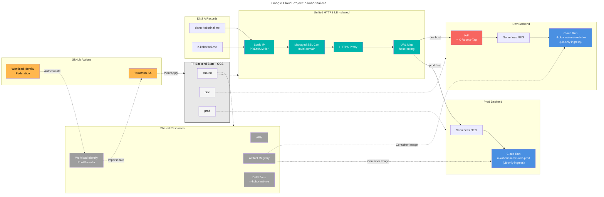

# n-koborinai.me

Personal website + engineering playground for `n-koborinai`.  
The repository hosts both the Next.js application and the Google Cloud infrastructure (managed via CDK for Terraform 0.21.x).

## Project Goals

- Deliver a fast personal site with MDX-based content, deployable to Cloud Run (dev/prod) via a shared HTTPS load balancer.
- Keep every change (infra + app) under version control and shipped only through GitHub Actions using Workload Identity Federation.
- Maintain o11y: Cloud Logging/Monitoring/Trace, structured logging, PV tracking, and a secure contact flow.

## Architecture Snapshot



**Key Differences by Environment:**

| Layer | Dev (`dev.n-koborinai.me`) | Prod (`n-koborinai.me`) |
| --- | --- | --- |
| Runtime | Cloud Run (`n-koborinai-me-web-dev`) | Cloud Run (`n-koborinai-me-web-prod`) |
| Access | IAP allow list + `X-Robots-Tag: noindex` | Public (no IAP) |
| Ingress | `INGRESS_TRAFFIC_INTERNAL_LOAD_BALANCER` | `INGRESS_TRAFFIC_INTERNAL_LOAD_BALANCER` |
| Scaling | Min: 0, Max: 1 | Min: 0, Max: 10 |
| Env Vars | `NODE_ENV=development`, `NEXT_PUBLIC_ENV=dev` | `NODE_ENV=production`, `NEXT_PUBLIC_ENV=prod` |
| Content | Same MDX; may include drafts | Reviewed content only |
| Analytics | GA4 (debug view) + optional server events | GA4 + server events + Cloud Monitoring |

## Tech Stack

- **Frontend**: Next.js (App Router), MDX, Tailwind CSS, TypeScript.
- **Content Management**: MDX stored under `content/` within git. No separate CMS or admin UI; PR reviews gate any publication. Drafts reside in `content/drafts` and can be excluded from prod builds.
- **Analytics & o11y**:
  - Google Analytics 4 for baseline PV/engagement.
  - Optional custom `/api/track` endpoint writing to Cloud Logging → BigQuery for privacy-friendly metrics.
  - Cloud Monitoring dashboards + alert policies (via Terraform) for Cloud Run metrics.
- **Infrastructure**: CDK for Terraform 0.21.x (TypeScript) targeting Google Cloud.
- **CI/CD**: GitHub Actions (Workload Identity), separate workflows per `shared` / `dev` / `prod`.
- **Testing**: Vite + Vitest (shared config across app and infra), Playwright for future E2E if needed.

## Repository Layout (planned)

```text
.
├── app/                    # Next.js application (to be created)
├── content/                # MDX articles/pages, versioned with git
├── docs/                   # Architecture notes, contact-flow specs, etc.
├── infrastructure/         # CDKTF project (shared/dev/prod stacks)
├── .github/workflows/      # CI pipelines (plan/apply, app deploy)
├── README.md               # This file
└── AGENTS.md               # English operations guide for collaborators
```

## Workflow Overview

1. **Infra changes**: edit CDKTF stacks → `npm run test:infra` → open PR → GitHub Actions runs synth/plan → reviewer approves → merge triggers apply on the right environment.
2. **App changes**: edit Next.js/MDX → `npm run test` + `npm run lint` → PR → CI builds container, pushes to Artifact Registry, and updates Cloud Run via Terraform apply.
3. **Content-only updates**: modify MDX, include frontmatter (`title`, `slug`, `published`, etc.), run `npm run content:lint`, open PR. Draft pieces stay under `content/drafts`.

## Local Setup (once the app repo is initialized)

```bash
# Node.js >= 20, npm 10 recommended
npm install

# Run Next.js dev server (app directory)
npm run dev --prefix app

# Run infrastructure unit tests
npm run test:infra --prefix infrastructure
```

## Infrastructure Dev Notes

- CDKTF `cdktf.json` uses `node lib/main.js` and pins `google` / `google-beta` providers to `~> 6.50`.
- Each stack configures `GcsBackend` with the same bucket but different prefixes (`shared`, `dev`, `prod`).

### Shared Stack (✅ Implemented)

- **API enablement**: Run, Compute, IAM, DNS, Artifact Registry, IAP, Monitoring, Logging, Certificate Manager.
- **Artifact Registry**: Container images repository (`n-koborinai-me-web`).
- **Global static IP**: PREMIUM tier for HTTPS load balancer.
- **Managed SSL Certificate**: Multi-domain (`n-koborinai.me`, `dev.n-koborinai.me`).
- **HTTPS Load Balancer**:
  - Serverless NEGs (dev/prod) referencing Cloud Run services by name.
  - Backend Services:
    - Dev: IAP enabled + `X-Robots-Tag: noindex, nofollow` header.
    - Prod: No IAP, logging enabled.
  - URL Map (host-based routing).
  - Target HTTPS Proxy.
  - Global Forwarding Rule.
- **Workload Identity Federation**:
  - Pool: `github-actions-pool`.
  - Provider: `actions-firebase-provider` (OIDC issuer: `https://token.actions.githubusercontent.com`).
  - Service Account: `github-actions-service@{project}.iam.gserviceaccount.com`.
  - IAM binding: Subject-based binding for repository `nozomi-koborinai/n-koborinai-me`.
  - 12 Project IAM roles granted to Terraform SA.
- **DNS Configuration**:
  - DNS zone reference: `n-koborinai-me` (data source).
  - A records: `n-koborinai.me.` and `dev.n-koborinai.me.` pointing to static IP (TTL: 300).

### Dev Stack (✅ Implemented)

- **Cloud Run Service**: `n-koborinai-me-web-dev`.
  - Ingress: `INGRESS_TRAFFIC_INTERNAL_LOAD_BALANCER` (LB-only access).
  - Execution Environment: Gen2.
  - Environment Variables:
    - `NODE_ENV=development` (runtime mode).
    - `NEXT_PUBLIC_ENV=dev` (client-side environment identifier).
  - Scaling: Min 0, Max 1.

### Prod Stack (✅ Implemented)

- **Cloud Run Service**: `n-koborinai-me-web-prod`.
  - Ingress: `INGRESS_TRAFFIC_INTERNAL_LOAD_BALANCER` (LB-only access).
  - Execution Environment: Gen2.
  - Environment Variables:
    - `NODE_ENV=production` (runtime mode).
    - `NEXT_PUBLIC_ENV=prod` (client-side environment identifier).
  - Scaling: Min 0, Max 10.

## Contact & Analytics Design (planned)

- Contact form will post to `/api/contact` (Next.js Route Handler) with:
  - Payload validation (Zod), reCAPTCHA enforcement, structured logging to Cloud Logging.
  - Notification via SendGrid or Gmail API (configured via Secret Manager).
- `/api/track` endpoint will receive custom events and forward to Cloud Logging/BigQuery.
- GA4 integration via Google Tag Manager (prod: standard measurement, dev: DebugView only).

## Documentation

- `README.md`: quickstart + architectural highlights (this file).
- `AGENTS.md`: contribution workflow, review checklist, release rules, IaC philosophy.
- `docs/`: deeper specs (contact API design, observability runbooks, MDX authoring tips).

## Current Status

- ✅ **Infrastructure**:
  - Shared stack: HTTPS LB, Artifact Registry, Workload Identity, DNS A records.
  - Dev stack: Cloud Run service (`n-koborinai-me-web-dev`).
  - Prod stack: Cloud Run service (`n-koborinai-me-web-prod`).
- ✅ **CI/CD**: GitHub Actions workflows for plan/apply (shared/dev/prod) with Workload Identity Federation.
- ✅ **Documentation**: README with architecture diagram, AGENTS.md with coding standards and IaC philosophy.
- ✅ **Testing**: Unit tests with 100% coverage for infrastructure code.
- ⏳ **Application**: Next.js app to be scaffolded.
- ⏳ **Content**: MDX authoring workflow to be established.
