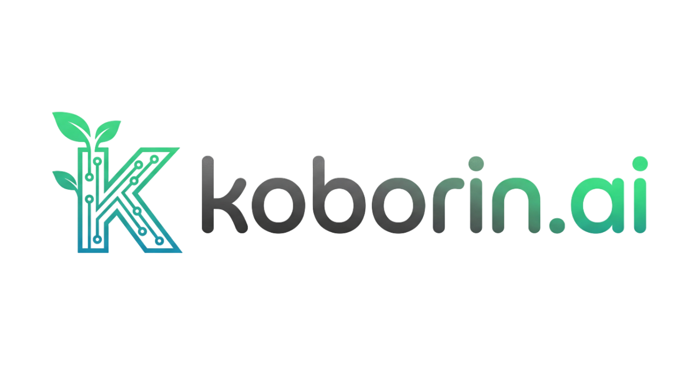
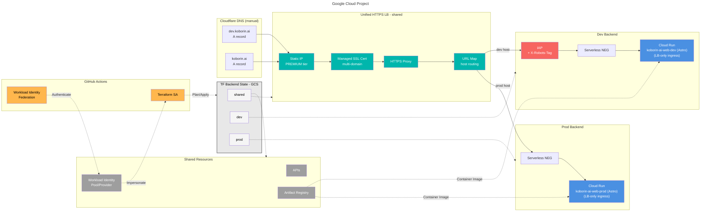
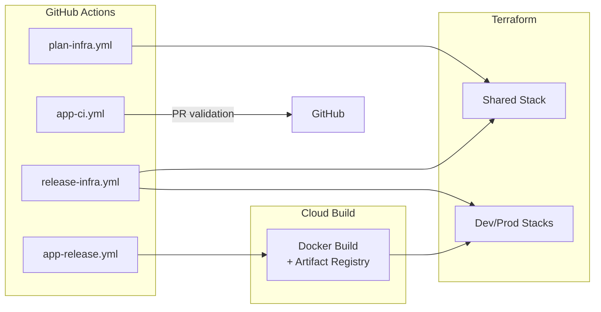

# koborin.ai



Technical garden for exploring AI, cloud architecture, and continuous learning.

Astro ( [](https://starlight.astro.build) ) runs on Cloud Run behind a global HTTPS load balancer, and the entire stack (app + infra) lives in this monorepo with CDK for Terraform 0.21.x.

## Architecture

Dev/Prod share the same HTTPS load balancer and Artifact Registry; only Cloud Run scaling/access policies differ.



> DNS is hosted in Cloudflare. Terraform does **not** manage DNS records; add/update `koborin.ai` / `dev.koborin.ai` A records manually whenever the load balancer IP changes.

### Environment matrix

| Layer | Dev (`dev.koborin.ai`) | Prod (`koborin.ai`) |
| --- | --- | --- |
| Runtime | Cloud Run (`koborin-ai-web-dev`) | Cloud Run (`koborin-ai-web-prod`) |
| Access | IAP allow list + `X-Robots-Tag: noindex` | Public (no IAP) |
| Ingress | `INGRESS_TRAFFIC_INTERNAL_LOAD_BALANCER` | `INGRESS_TRAFFIC_INTERNAL_LOAD_BALANCER` |
| Scaling | Min: 0, Max: 1 | Min: 0, Max: 10 |
| Env Vars | `NODE_ENV=development`, `NEXT_PUBLIC_ENV=dev` | `NODE_ENV=production`, `NEXT_PUBLIC_ENV=prod` |
| Content | Same MDX content (no env-specific filtering) | Same MDX content (no env-specific filtering) |
| Analytics | GA4 (debug view) + optional server events | GA4 + server events + Cloud Monitoring |

## CI/CD

Infrastructure and application deploys are each handled by dedicated GitHub Actions workflows using Workload Identity Federation.



| Workflow | Trigger | Purpose | Notes |
| --- | --- | --- | --- |
| `plan-infra.yml` | PRs touching infra | Synth + plan for shared/dev/prod stacks | No apply; reviewers inspect plan output |
| `release-infra.yml` | `infra-v*` tags or manual dispatch | Applies shared/dev/prod stacks via CDKTF | Workload Identity SA has infra IAM roles |
| `app-ci.yml` | PRs touching `app/` or `content/` | Runs Astro lint/typecheck/test/build | Blocks merges that break the app |
| `app-release.yml` | Merge to `main` or `app-v*` tags | One job builds + pushes Docker image (tag = `${GITHUB_SHA}-${GITHUB_RUN_ID}`) and applies Terraform to update Cloud Run | Cloud Build runs asynchronously; CDKTF consumes the new image URI |

## Tech Stack

- **Frontend**: Astro with Starlight (documentation theme), TypeScript, Tailwind CSS.
- **Content Management**: MDX stored under `app/src/content/docs/` within git. Frontmatter is validated via Zod schemas (from Starlight) to keep metadata type-safe. Drafts can be marked with `draft: true` in frontmatter.
- **Analytics & o11y**:
  - Google Analytics 4 for baseline PV/engagement.
  - Optional custom `/api/track` endpoint writing to Cloud Logging → BigQuery for privacy-friendly metrics.
  - Cloud Monitoring dashboards + alert policies (via Terraform) for Cloud Run metrics.
- **Infrastructure**: CDK for Terraform 0.21.x (TypeScript) targeting Google Cloud.
- **CI/CD**: GitHub Actions with Workload Identity. `plan-infra.yml` / `release-infra.yml` drive infra, `app-ci.yml` / `app-release.yml` handle the Astro app.
- **Testing**: Vite + Vitest (shared config across app and infra), Playwright for future E2E if needed.

## Repository Layout (planned)

```text
.
├── app/                           # Astro + Starlight application (SSR, Docker)
│   ├── src/
│   │   ├── assets/               # Images and static assets
│   │   │   ├── koborin-ai-header.png  # Header logo
│   │   │   └── koborin-ai-hero.jpeg   # Hero image for index page
│   │   ├── content/
│   │   │   ├── docs/             # MDX documentation pages (Starlight)
│   │   │   └── config.ts         # Content Collections schema
│   │   ├── pages/                # Custom Astro pages (if needed)
│   │   └── styles/
│   │       └── custom.css        # Custom CSS overrides (logo sizing, etc.)
│   ├── public/
│   │   ├── favicon.png           # Browser tab icon
│   │   └── robots.txt
│   ├── Dockerfile
│   └── astro.config.mjs          # Starlight integration config
├── docs/                          # Architecture notes, contact-flow specs, etc.
├── infrastructure/                # CDKTF project (shared/dev/prod stacks)
├── .github/workflows/             # CI pipelines (plan/apply, app deploy)
├── README.md                      # This file
└── AGENTS.md                      # English operations guide for collaborators
```

### Brand Assets

| Asset | Location | Usage | Notes |
| --- | --- | --- | --- |
| Favicon | `app/public/favicon.png` | Browser tab icon | PNG format, transparent background recommended |
| Header Logo | `app/src/assets/koborin-ai-header.png` | Site header (replaces title text) | Horizontal layout, optimized for dark backgrounds |
| Hero Image | `app/src/assets/koborin-ai-hero.jpeg` | Landing page hero section | 16:9 aspect ratio recommended |

Logo sizing is customized via `app/src/styles/custom.css` (`.site-title img` selector).

## Workflow Overview

1. **Infra changes**: edit CDKTF stacks → `npm run test:infra` → open PR → GitHub Actions runs synth/plan → reviewer approves → merge triggers apply on the right environment.
2. **App changes**: edit Astro/MDX → `npm run lint && npm run test && npm run typecheck && npm run build` → PR triggers `app-ci.yml` → merge to `main` (or tag `app-v*`) triggers `app-release.yml` which builds the container, pushes to Artifact Registry, and feeds the new image to CDKTF.
3. **Content-only updates**: modify MDX under `app/src/content/docs/`, update frontmatter (`title`, `description`), run `npm run lint`, open PR. Mark drafts with `draft: true` in frontmatter to exclude from production builds.

### Adding New Content

To add a new article or page:

1. **Create MDX file** under `app/src/content/docs/` (or subdirectory for categories):

   ```bash
   # Single page
   app/src/content/docs/my-article.mdx

   # Categorized page
   app/src/content/docs/blog/my-post.mdx
   ```

2. **Add frontmatter** with required fields:

   ```yaml
   ---
   title: My Article Title
   description: Brief description of the article
   ---
   ```

3. **Update sidebar** in `app/src/sidebar.ts`:

   ```typescript
   export const sidebar = [
     // ... existing items
     {
       label: "Blog",
       items: [
         { label: "My Post", slug: "blog/my-post" },
       ],
     },
   ];
   ```

4. **Build and test** locally before pushing.

## Release Strategy

- Infra applies use `infra-v*` tags to trigger `release-infra.yml`. Tag the repo after merging infra PRs even if app work is still ongoing; this ensures the latest load balancer/stateful resources are deployed before app images roll out.
- App deploys use `app-v*` tags to drive `app-release.yml`. Tagging after a successful `main` merge guarantees that the latest container image is built and the Cloud Run service is updated via CDKTF.
- GitHub release notes are generated via `.github/release.yml`. Label each PR with `app`, `infra`, `terraform`, `feature`, `bug`, or `doc` so the notes stay segmented by domain; apply the `ignore` label to omit a PR entirely.

## Local Setup (once the app repo is initialized)

```bash
# Node.js >= 20, npm 10 recommended
npm install

# Run Astro dev server (app directory)
npm run dev --prefix app

# Run infrastructure unit tests
npm run test:infra --prefix infrastructure
```

## Infrastructure Dev Notes

- CDKTF `cdktf.json` uses `node lib/main.js` and pins `google` / `google-beta` providers to `~> 6.50`.
- Each stack configures `GcsBackend` with the same bucket but different prefixes (`shared`, `dev`, `prod`).

### Shared Stack

- **API enablement**: Run, Compute, IAM, Artifact Registry, IAP, Monitoring, Logging, Certificate Manager.
- **Artifact Registry**: Container images repository (`koborin-ai-web`).
- **Global static IP**: PREMIUM tier for HTTPS load balancer.
- **Managed SSL Certificate**: Multi-domain (`koborin.ai`, `dev.koborin.ai`).
- **HTTPS Load Balancer**:
  - Serverless NEGs (dev/prod) referencing Cloud Run services by name.
  - Backend Services:
    - Dev: IAP enabled + `X-Robots-Tag: noindex, nofollow` header.
    - Prod: No IAP, logging enabled.
  - URL Map (host-based routing).
  - Target HTTPS Proxy.
  - Global Forwarding Rule.
- **Workload Identity Federation**:
  - Pool: `github-actions-pool`.
  - Provider: `actions-firebase-provider` (OIDC issuer: `https://token.actions.githubusercontent.com`).
  - Service Account: `github-actions-service@{project}.iam.gserviceaccount.com`.
  - IAM binding: Subject-based binding for repository `nozomi-koborinai/koborin-ai`.
  - Project IAM roles (Artifact Registry, Run, Compute, IAM, etc.) granted to the Terraform SA.
- **DNS**: Records live in Cloudflare and are managed manually (A records point to the LB IP).

### Dev Stack

- **Cloud Run Service**: `koborin-ai-web-dev`.
  - Ingress: `INGRESS_TRAFFIC_INTERNAL_LOAD_BALANCER` (LB-only access).
  - Execution Environment: Gen2.
  - Environment Variables:
    - `NODE_ENV=development` (runtime mode).
    - `NEXT_PUBLIC_ENV=dev` (client-side environment identifier).
  - Scaling: Min 0, Max 1.

### Prod Stack

- **Cloud Run Service**: `koborin-ai-web-prod`.
  - Ingress: `INGRESS_TRAFFIC_INTERNAL_LOAD_BALANCER` (LB-only access).
  - Execution Environment: Gen2.
  - Environment Variables:
    - `NODE_ENV=production` (runtime mode).
    - `NEXT_PUBLIC_ENV=prod` (client-side environment identifier).
  - Scaling: Min 0, Max 10.

## Contact & Analytics Design (planned)

- Contact form will post to `/api/contact` (Astro API Route) with:
  - Payload validation (Zod), reCAPTCHA enforcement, structured logging to Cloud Logging.
  - Notification via SendGrid or Gmail API (configured via Secret Manager).
- `/api/track` endpoint will receive custom events and forward to Cloud Logging/BigQuery.
- GA4 integration via Google Tag Manager (prod: standard measurement, dev: DebugView only).

## Documentation

- `README.md`: quickstart + architectural highlights (this file).
- `AGENTS.md`: contribution workflow, review checklist, release rules, IaC philosophy.
