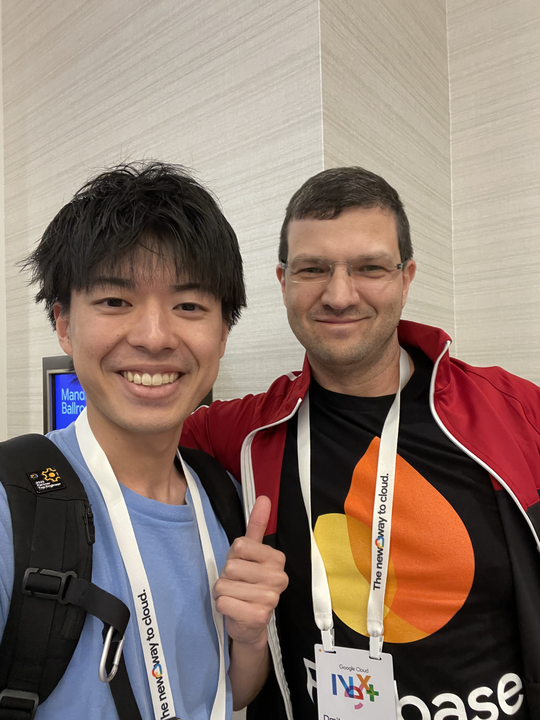
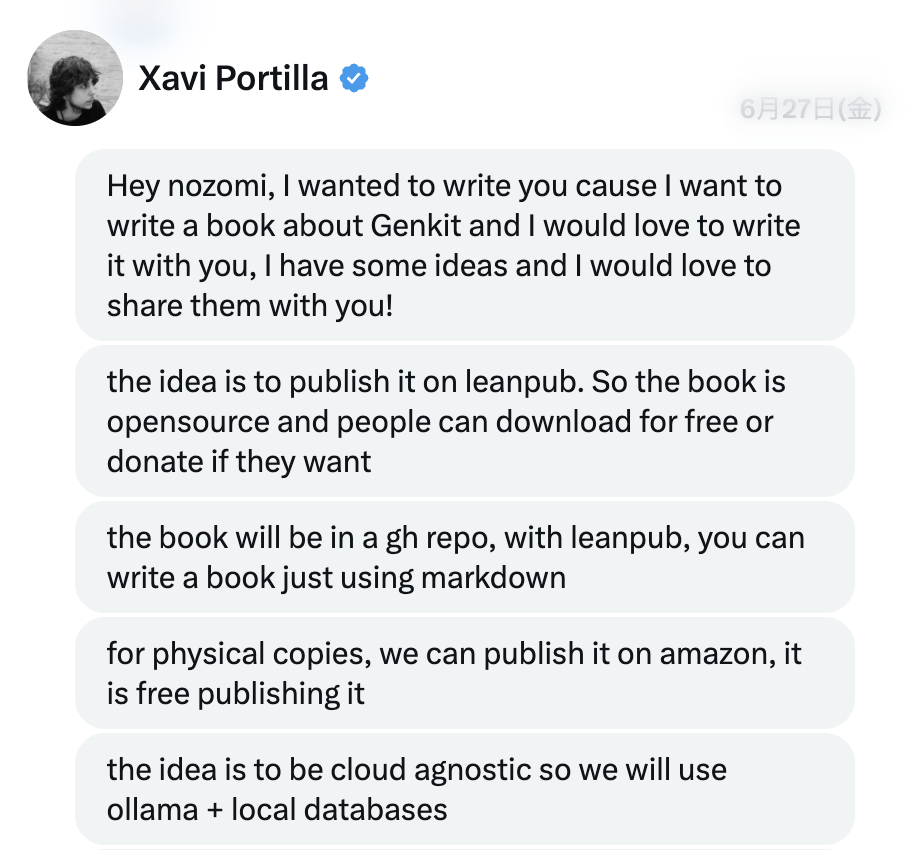
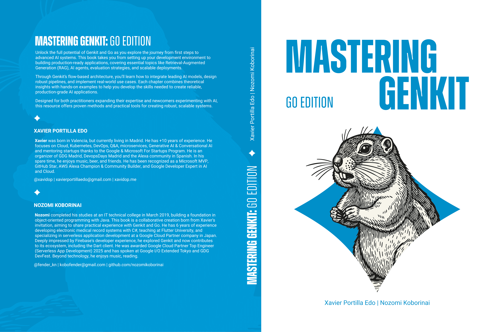

今年、2025 年は、今まで家に篭っていた私にとって激動の 1 年だった。
初の海外旅行、ライフステージの変化、海外のエンジニアとの書籍共同執筆、出版、そしてメインのお仕事での昇格。
これらの出来事を通して、私自身のメンタルモデルも大きく変わりつつある。整理の意味も込めてブログを書こうと思う。

## 1. Google Cloud Next '25

今年は、GCP 技術の祭典である [Google Cloud Next '25](https://cloud.withgoogle.com/next/25) に参加した。
当時、サーバーレス製品に興味のあった私は、Cloud Run や Identity Platform や Firebase 製品に関わる Google のエンジニアとお話しした。

本来であれば、その製品に対しての feature request を出す予定だった。
けど、いざ本人を前にすると何も言えなかった。
英語も勉強中で、頭の中にある伝えたいことの、ほんの少しの言葉もでない。
ただ黙ってしまう時間が続いた。とにかく情けない感情になった。

でも、自分が普段愛してやまない製品のプロダクトマネージャーに会えたという興奮は隠せなくて、結局言えたのは「大好きです」という単純な一言だけ。
それでも、その気持ちは伝わったのかもしれない。そう信じたい。
Google の AI 開発フレームワーク [Genkit](https://genkit.dev/) に関わり、現在 Gemini CLI プロダクトリーダーを務める [Dmitry Lyalin](https://www.linkedin.com/in/dmitrylyalin/) さんが、私の拙い英語から何かを感じ取ってくれたことが嬉しかった。

「私は、開発者体験の向上こそが最大の喜びであり、やりがいなんです」
翻訳アプリを使いながら必死に伝えた。
OSS へのコントリビュートや、その技術記事を広めることで、その技術を世界中のエンジニアに知ってもらえるなら幸せである、と。

そしたら日本に滞在する DevRel である [Sumit Chandel](https://www.linkedin.com/in/sumit-chandel-a273792/) さんまで紹介していただき、帰国後にオフィスツアーにまで招待してもらえた。

言葉がうまく話せなくても、感情で繋がれることもあるんだなと実感した。
その後も、その熱が冷めることはなく、[Medium](https://medium.com/@nozomi-koborinai) や [Awesome リスト](https://github.com/xavidop/awesome-genkit) への貢献を続けた。

## 2. 書籍共同執筆

そしたら、スペインで活躍している AI 領域の GDE (Google Developer Experts)、[Xavi Portilla](https://www.linkedin.com/in/xavierportillaedo/) さんから、一緒に Genkit に関する本を書かないかというダイレクトメッセージが届いた。

OSS の世界は本当に面白い。こんな出会いや活動につながるとは思っていなかった。

当時 JavaScript (TypeScript) 版のみ GA だった Genkit だが、2025/10 下旬 GA 予定だった Genkit for Go のためにも `Mastering Genkit: Go Edition` を先にリリースしようという動きもあり、プロモーションという観点でも勉強させてもらった。
スペインと日本の時差は約 7 時間。睡眠時間を大幅に削る日々が 4 ヶ月ほど続いた。
正直しんどかった場面も多かったが、でも、エンジニアとして生きる私にとっては、それ以上に楽しい時間だった。

Xavi さんからは多くのことを学んだ。
特に「時間をかけて人に良いものを届けるという姿勢」。
焦らなくていい、大きな変更がある時こそ時間をかけた方がいいものを届けられるということ。
私が書いた内容の構成や、英語の本としての構成についても、非常にフラットにアドバイスをくれた。

[Mastering Genkit: Go Edition](https://www.amazon.com/dp/B0G4HKJRPB)

AI が発達し続ける時代だからこそ、自分の思考性をものづくりに込めていくべきだと思う。
Xavi さんとの共同執筆を通じて、それを実践できたし、世に出せたのは良い経験だった。

## 3. 仕事

仕事においても大きな変化があった。
今年から 4 人のチームのリーダーをしている。
週 1 回、1 時間の 1on1 の時間を設けて、メンバーの話を聞いている。

これはプロジェクトの開発リーダーやプロジェクトマネージャーとして技術的な指示を出すわけではない。
会社の案件に別々にアサインされるメンバーたちなので、基本的にバラバラになる。
だからこそ、メンタル面や普段の仕事での悩み、どのような技術領域をやっていきたいのか、どのようなキャリアを選んでいきたいのか、どの案件に関わっていきたいのかといった話を聞く場が必要だと思っている。
メンバーにはデザイナーもいれば、FE 志望のエンジニアや SRE 志望のエンジニアもいる。

繰り返しにはなるが、AI がどれだけ発達しても、人との対話はなくならないと思う。
人との会話によって自分のメンタルモデルが強化されて、自分と相手両方が、どこにいるのが心地が良いのか、成長のためにどんな世界を見せてあげたらいいのか、そんなことを考えるようになった。
気づいたら、勝手に親心みたいなものが芽生えていた。（なんとなく。）

人には何十年も生活してきた環境があり、その環境が人間性に反映されている。だから人との会話は面白い。
自分も他人の「当たり前」みたいな視点をもらったりして、人と人の在り方みたいな部分を 20 代前半よりも学んでいる気がする。

そして、自分が今まで経験してきたものを言葉にして相手に伝えると、それを、わからないなりにも理解しようとしてくれる。
それが、自分勝手ではありながらも嬉しいと思う。
そうやってお互いに影響を与え合いながら、エンジニアとしても人間としても成長していけたらいいなと思っている。

## 4. コミュニティ

[Flutter 大学](https://flutteruniv.com/) というエンジニアコミュニティがある。
私がここに入会してから、気づいたら 3 年半以上が経過している。
新規入会者の 1on1 メンターをするというちょっとした運営に携わりながらも、基本は参加者として参加している。
自分の times に投稿したり、Genkit をはじめとした他コミュニティの知見を Flutter に落とすために情報を広げたり、Flutter 大学が運営するイベントにたまーに登壇者として参加したりしている。

このコミュニティは、ほとんどが別の会社のエンジニアである。
自分の抱えている悩みも比較的相談しやすいし、興味のあるイベントがあれば声をかけて一緒に参加したり、逆に声をかけてもらったりと、非常に活発だ。
今は、AI エージェントアプリケーションを作るプロジェクトに取り組んでいる。

私がエンジニアの世界が広いと感じたのは、このコミュニティに入ったからだ。
上京を決めたのも、転職してやりがいのある仕事に就けたのも、プライベートの OSS 活動を楽しめているのも、書籍執筆につながったのも、すべてこのコミュニティがあったからである。

2026 年は Flutter 大学のリブランディングが行われるとのことで、その成長に少しでも貢献して恩返しできたらなと思っている。

## 5. 支えてくれた人

今年、ライフステージの大きな変化があった。
今年の挑戦を一番近くで支えてくれた人がいる。
あまり深くまでは話せないが、Google Cloud Next では、私が英語をあまりにも話せない、聞けない中、Firebase ブースで私と Google エンジニアの間に立って通訳してくれた。
書籍執筆で睡眠を削っていた 4 ヶ月間は、私の「キリのいいところまで作業しないと気が済まない」という性格を理解してくれつつも、体調を一番に気遣ってくれた。

私のしんどい部分も、変なこだわりも知った上で、隣にいてくれた。
どれだけ支えられたことか。いつも感謝してます。

## さいごに

2025 年は、これからのキャリア形成のための出発点でしかない。
英語が話せない自分、睡眠を削って没頭する自分、メンバーへの親心に目覚める自分。隣で支えてくれる人の大切さに気づく自分。
そんな自分を発見した年だった。

2026 年はもっと高い飛躍ができるように、プライベートも仕事も、エンジニアとして、一人の人間として、もっと様々な人や環境に立ち向かっていきたい。
