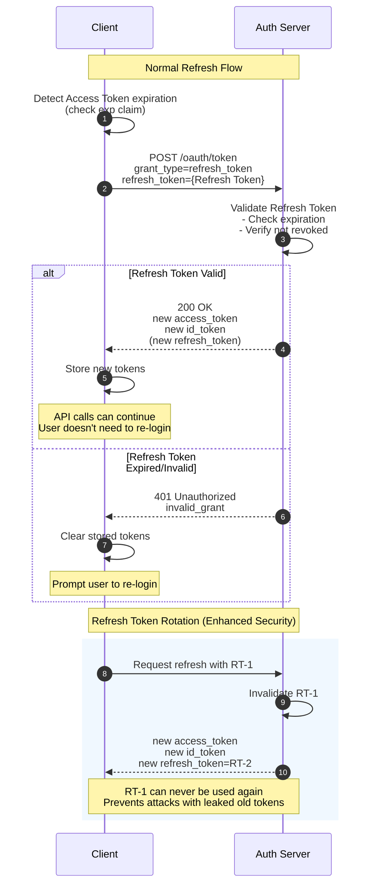

> **Note:** この記事は、Firebase Auth の認証トークンについて調べた際の個人的な調査メモです。体系的なガイドというよりは、学習過程で整理した内容をまとめたものになります。

このガイドでは、OAuth 2.0 / OpenID Connect における認証トークンの基礎を、Firebase Auth の特徴を中心に解説します。

---

## 1. 認証と認可

| 概念                       | 説明                       | 例                                      |
| -------------------------- | -------------------------- | --------------------------------------- |
| **認証（Authentication）** | 「あなたは誰か」を確認する | ログイン処理、パスワード検証、SAML 認証 |
| **認可（Authorization）**  | 「何ができるか」を確認する | 管理者権限のチェック、グループ所属確認  |

- 認証が先、認可が後です。認証されていないユーザーは認可できません。

---

## 2. トークンの種類と役割

### 2.1 OAuth 2.0 / OpenID Connect のトークン

| トークン          | 目的                 | 内容                  | 使用場所               | 一般的な有効期限 |
| ----------------- | -------------------- | --------------------- | ---------------------- | ---------------- |
| **ID Token**      | ユーザー識別         | UID、メール、名前など | フロントエンド         | 5分〜1時間       |
| **Access Token**  | リソースアクセス認可 | スコープ、権限        | バックエンド API       | 5分〜1時間       |
| **Refresh Token** | トークン更新         | ランダム文字列        | トークン更新リクエスト | 7〜90日          |

### 2.2 ID Token

- **目的**: 「この人は誰か」を証明する
- **使用場所**: クライアント（フロントエンド）内で消費
- **ユースケース**: ユーザー名の表示、プロフィール表示、UI のパーソナライズ
- **形式**: JWT (JSON Web Token)

### 2.3 Access Token

- **目的**: 「このリソースへのアクセス権限がある」ことを証明する
- **使用場所**: バックエンド API に送信 (`Authorization: Bearer {token}`)
- **ユースケース**: API 認可、リソースアクセス制御
- **形式**: JWT または Opaque Token

### 2.4 Refresh Token

- **目的**: 新しい ID Token / Access Token を取得する
- **使用場所**: 認証サーバーへのトークン更新リクエスト
- **ユースケース**: Access Token の有効期限切れ時に、再ログインなしで新しいトークンを取得
- **形式**: Opaque Token（内容は不可視）

---

## 3. JWT (JSON Web Token) の構造

ID Token と Access Token は、多くの場合 JWT 形式で作成されます。JWT は3つの部分で構成されています：

```plain
eyJhbGciOiJSUzI1NiIsInR5cCI6IkpXVCJ9.eyJpc3MiOiJodHRwczovL...
├──────────── Header ────────────┤├────────── Payload ──────────...
```

### 3.1 Header

```json
{
  "alg": "RS256",
  "typ": "JWT"
}
```

- `alg`: 署名アルゴリズム
- `typ`: トークンタイプ

### 3.2 Payload = Claims の集合

```json
{
  "iss": "https://securetoken.google.com/my-project",
  "sub": "XeOK4KBxyz123abc",
  "aud": "my-project",
  "iat": 1704067200,
  "exp": 1704070800,
  "email": "user@example.com",
  "firebase": {
    "sign_in_provider": "password"
  }
}
```

| Claim   | 意味                       |
| ------- | -------------------------- |
| `iss`   | 発行者                     |
| `sub`   | 主体 = ユーザー ID (UID)   |
| `aud`   | 対象者 = プロジェクト ID   |
| `iat`   | 発行日時（タイムスタンプ） |
| `exp`   | 有効期限（タイムスタンプ） |
| `email` | メールアドレス             |

### 3.3 署名

- Header と Payload を秘密鍵で署名
- 改ざんされると署名が一致しない
- サーバー側で `verifyIdToken()` などを使用して検証

---

## 4. OAuth 2.0 / OpenID Connect のフロー

### 4.1 トークン取得タイミング

認証が成功すると、**ID Token / Access Token / Refresh Token が1つのレスポンスで同時に発行されます**：

```json
{
  "access_token": "eyJhbG...",
  "token_type": "Bearer",
  "expires_in": 3600,
  "refresh_token": "dGhpcyB...",
  "id_token": "eyJhbGci..."
}
```

### 4.2 有効期限管理

- **認証サーバーが決定**: 認証サーバー（IdP）がすべてのトークンの有効期限を設定
- **JWT の場合**: `exp` claim に有効期限のタイムスタンプが含まれる
- **設定可能性**: プロバイダーによって異なる - 開発者が設定できるものとできないものがある

### 4.3 トークン更新フロー



- Access Token の有効期限が切れたら、Refresh Token を使って新しいトークンを取得
- **1つの Refresh Token で ID Token と Access Token の両方を更新**
- ユーザーは再ログインの必要なし

---

## 5. Firebase Auth の特徴

### 5.1 ID Token が Access Token を兼ねる

| 側面           | 標準 OAuth 2.0          | Firebase Auth       |
| -------------- | ----------------------- | ------------------- |
| トークンの種類 | ID Token + Access Token | **ID Token のみ**   |
| API 認証       | Access Token を使用     | **ID Token を使用** |
| 管理の複雑さ   | 2種類を管理             | 1種類を管理         |

- Firebase では、ID Token が「認証」と「認可」の両方を処理
- 開発者にとってシンプル - 1種類のトークンのみ管理

### 5.2 トークンの有効期限

| 項目                     | Firebase Auth                   |
| ------------------------ | ------------------------------- |
| ID Token の有効期限      | **1時間（固定、設定変更不可）** |
| Refresh Token の有効期限 | **実質無制限**                  |

Firebase の Refresh Token が無効化されるのは以下の場合のみ：

- ユーザーが削除された
- ユーザーが無効化された
- パスワードまたはメールアドレスが変更された
- `revokeRefreshTokens(uid)` が明示的に呼び出された

### 5.3 SDK の種類と使用方法

#### クライアント側 SDK（自動 Refresh Token 使用）

| SDK                                       | ユースケース                 |
| ----------------------------------------- | ---------------------------- |
| Firebase JavaScript SDK (`firebase/auth`) | Web アプリ                   |
| Firebase iOS SDK                          | iOS アプリ                   |
| Firebase Android SDK                      | Android アプリ               |
| Firebase Flutter SDK                      | クロスプラットフォームアプリ |

- `user.getIdToken()` を呼び出すだけ - 有効期限切れの場合は自動更新
- 開発者は Refresh Token を直接扱う必要なし

#### サーバー側 Admin SDK（Refresh Token 管理/無効化）

| SDK                            | ユースケース |
| ------------------------------ | ------------ |
| Firebase Admin SDK for Node.js | サーバー側   |
| Firebase Admin SDK for Python  | サーバー側   |
| Firebase Admin SDK for Java    | サーバー側   |
| Firebase Admin SDK for Go      | サーバー側   |

- Refresh Token に直接アクセスできない
- `revokeRefreshTokens(uid)` での無効化のみ可能

### 5.4 ユーザー体験とセキュリティのバランス

| 視点               | 見え方                                                       |
| ------------------ | ------------------------------------------------------------ |
| **ユーザーの視点** | 「常にログインしている」                                     |
| **内部動作**       | ID Token は1時間ごとに期限切れになり、必要に応じて更新される |

**なぜこの設計なのか？**

| 側面                                 | 理由                                               |
| ------------------------------------ | -------------------------------------------------- |
| **短い ID Token（1時間）**           | 漏洩しても1時間後に無効になる（被害を限定）        |
| **長い Refresh Token（実質無制限）** | ユーザーは繰り返しログインしたくない（UX 優先）    |
| **SDK の自動更新**                   | 開発者の手間なくセキュリティと UX のバランスを実現 |

Firebase Auth は「**セキュリティ面ではトークンが1時間ごとに変わるが、UX 面ではユーザーはログイン状態を維持**」を実現しています。

---

## 6. ブラウザストレージの種類

トークンやセッション情報の保存場所は、セキュリティと利便性のトレードオフを伴います。

### 6.1 ストレージ種類の概要

| ストレージ          | 寿命                  | タブ間共有 | サーバーへ自動送信 | JS アクセス           | 容量   |
| ------------------- | --------------------- | ---------- | ------------------ | --------------------- | ------ |
| **Session Storage** | タブを閉じるまで      | 不可       | 不可               | 可能                  | 約5MB  |
| **Local Storage**   | 永続（削除するまで）  | 可能       | 不可               | 可能                  | 約5MB  |
| **Cookie**          | maxAge/expires で設定 | 可能       | **可能**           | httpOnly でブロック可 | 約4KB  |
| **IndexedDB**       | 永続                  | 可能       | 不可               | 可能                  | 大容量 |

### 6.2 Session Storage

- **保存場所**: ブラウザ（Web Storage API）
- **寿命**: タブ/ウィンドウを閉じるまで
- **スコープ**: 同一タブのみ（タブ間で共有されない）
- **ユースケース**: 一時的なデータ（ログイン中のみ必要な UI 状態）

```javascript
// 保存
sessionStorage.setItem("key", "value");
// 取得
const value = sessionStorage.getItem("key");
// 削除
sessionStorage.removeItem("key");
```

### 6.3 Local Storage

- **保存場所**: ブラウザ（Web Storage API）
- **寿命**: 明示的に削除するまで永続
- **スコープ**: 同一オリジン内で共有（すべてのタブ間）
- **ユースケース**: ユーザー設定、キャッシュデータ

```javascript
// 保存
localStorage.setItem("key", "value");
// 取得
const value = localStorage.getItem("key");
// 削除
localStorage.removeItem("key");
```

### 6.4 Cookie

- **保存場所**: ブラウザ
- **寿命**: maxAge/expires で設定
- **スコープ**: 同一オリジン（サブドメイン設定可能）
- **重要な特徴**: **リクエストと共にサーバーへ自動送信**
- **ユースケース**: 認証トークン、セッション管理

```javascript
// 設定（サーバー側）
response.cookies.set("name", "value", {
  httpOnly: true, // JS からアクセス不可
  secure: true, // HTTPS のみ
  sameSite: "lax", // CSRF 保護
  maxAge: 86400, // 1日（秒）
});
```

### 6.5 IndexedDB

- **保存場所**: ブラウザ（NoSQL データベース）
- **寿命**: 明示的に削除するまで永続
- **スコープ**: 同一オリジン内
- **ユースケース**: 大容量データ、オフラインデータ、**Firebase SDK のトークン保存**

Firebase Auth SDK は ID Token と Refresh Token を IndexedDB に自動保存します：

```plain
IndexedDB: firebaseLocalStorageDb
  └─ firebaseLocalStorage
      └─ firebase:authUser:{apiKey}:{appName}
```

### 6.6 トークン保存場所の選択

| 保存場所              | XSS 攻撃リスク        | 推奨用途                  |
| --------------------- | --------------------- | ------------------------- |
| Session Storage       | 盗まれる可能性あり    | 一時的なデータ            |
| Local Storage         | 盗まれる可能性あり    | 非機密データ              |
| **Cookie (httpOnly)** | **JS で読み取り不可** | **認証トークン（推奨）**  |
| IndexedDB             | 盗まれる可能性あり    | Firebase SDK のデフォルト |
| メモリのみ            | ページ遷移で失われる  | 最も安全だが不便          |

### 6.7 Session Storage と Session Cookie

名前は似ていますが、まったく異なるメカニズムです：

| 側面         | Session Storage              | Session Cookie                  |
| ------------ | ---------------------------- | ------------------------------- |
| 管理者       | ブラウザ                     | サーバーが発行 → ブラウザが保存 |
| 寿命         | タブを閉じるまで             | サーバー定義（5分〜14日）       |
| サーバー送信 | 手動                         | 自動                            |
| httpOnly     | 不可（常に JS アクセス可能） | 設定可能                        |
| ユースケース | 一時的な UI 状態             | 認証セッション管理              |

---

## 7. Session Cookie（Firebase Auth のコンテキスト）

### 7.1 Cookie の種類（一般的な定義）

Cookie は有効期限設定に基づいて2種類に分類されます：

| 種類                  | 有効期限設定                        | 消えるタイミング   | ユースケース           |
| --------------------- | ----------------------------------- | ------------------ | ---------------------- |
| **Session Cookie**    | なし（`maxAge`/`expires` 未設定）   | ブラウザを閉じた時 | 一時的なセッション情報 |
| **Persistent Cookie** | あり（`maxAge`/`expires` 設定済み） | 有効期限到達時     | ログイン状態の維持     |

### 7.2 Firebase Auth の「Session Cookie」

Firebase Auth のドキュメントでは、「Session Cookie」は一般的な定義とは**異なる意味**を持ちます：

| 側面         | 一般的な Session Cookie          | Firebase Auth Session Cookie                |
| ------------ | -------------------------------- | ------------------------------------------- |
| 定義         | `maxAge`/`expires` のない Cookie | `createSessionCookie()` で発行された Cookie |
| 寿命         | ブラウザを閉じるまで             | **5分〜14日（設定可能）**                   |
| 技術的な分類 | Session Cookie                   | **Persistent Cookie**                       |
| ユースケース | 一時的なセッション               | サーバー側セッション管理                    |

**つまり、Firebase の「Session Cookie」は技術的には Persistent Cookie です。**

### 7.3 Session Cookie の概要（Firebase のコンテキスト）

Firebase Auth Session Cookie は、ユーザーセッションをサーバー側で管理するメカニズムです。ID Token をサーバーに送信し、Session Cookie に変換した後、以降のリクエストは Cookie ベースの認証を使用します。

| 側面         | ID Token 直接使用                | Session Cookie 使用                       |
| ------------ | -------------------------------- | ----------------------------------------- |
| 保存場所     | クライアント（メモリ/IndexedDB） | サーバーが発行 → ブラウザ Cookie          |
| 有効期限     | 1時間（固定）                    | 5分〜14日（設定可能）                     |
| 更新         | クライアント SDK 自動            | サーバー側で明示的に更新                  |
| セキュリティ | JavaScript からアクセス可能      | httpOnly で JavaScript アクセスをブロック |

### 7.4 Session Cookie の作成（Firebase Admin SDK）

```typescript
// サーバー側: ID Token を受け取り Session Cookie を発行
const expiresIn = 60 * 60 * 24 * 1000; // 1日（ミリ秒）

// ID Token を検証し Session Cookie を作成
const sessionCookie = await adminAuth.createSessionCookie(idToken, {
  expiresIn,
});

// レスポンスに Cookie を設定
response.cookies.set("__session", sessionCookie, {
  httpOnly: true, // JavaScript からアクセス不可（XSS 保護）
  secure: true, // HTTPS のみ
  sameSite: "lax", // CSRF 保護
  maxAge: expiresIn / 1000,
  path: "/",
});
```

### 7.5 Session Cookie の検証

```typescript
// サーバー側: Session Cookie を検証
const sessionCookie = cookies().get("__session")?.value;
const decodedClaims = await adminAuth.verifySessionCookie(sessionCookie, true);
// decodedClaims.uid, decodedClaims.email などにアクセス
```

### 7.6 セキュリティフラグ

| フラグ     | 値     | 効果                                                  |
| ---------- | ------ | ----------------------------------------------------- |
| `httpOnly` | `true` | JavaScript からアクセス不可（XSS 保護）               |
| `secure`   | `true` | HTTPS でのみ Cookie を送信                            |
| `sameSite` | `lax`  | 同一サイトリクエストでのみ Cookie を送信（CSRF 保護） |
| `maxAge`   | 秒     | Cookie の有効期限                                     |
| `path`     | `/`    | Cookie が有効なパス                                   |

### 7.7 Session Cookie の有効期限

| 項目 | 値                                                |
| ---- | ------------------------------------------------- |
| 最小 | 5分（300,000 ミリ秒）                             |
| 最大 | 14日（1,209,600,000 ミリ秒）                      |
| 設定 | `createSessionCookie()` の `expiresIn` オプション |

### 7.8 ID Token 直接使用 vs Session Cookie

| 側面                 | ID Token 直接使用              | Session Cookie                |
| -------------------- | ------------------------------ | ----------------------------- |
| **実装の複雑さ**     | シンプル                       | より複雑（Cookie 管理が必要） |
| **有効期限の柔軟性** | 1時間固定                      | 5分〜14日で設定可能           |
| **XSS 耐性**         | 低い（JS アクセス可能）        | 高い（httpOnly）              |
| **CSRF 耐性**        | 高い（明示的なヘッダーが必要） | sameSite で保護               |
| **更新**             | SDK 自動                       | 手動更新プロセスが必要        |
| **SSR サポート**     | 追加実装が必要                 | Cookie 自動送信               |

#### 詳細なセキュリティ比較

**XSS 攻撃耐性**

| 方式              | 保存場所           | XSS リスク                                                                                            |
| ----------------- | ------------------ | ----------------------------------------------------------------------------------------------------- |
| Session Cookie    | Cookie (httpOnly)  | JS で読み取り不可。ただし、Cookie は自動送信されるため、攻撃者が API を呼び出せる可能性あり           |
| ID Token 直接使用 | IndexedDB / メモリ | `localStorage.getItem()` や IndexedDB 経由で盗まれるリスク。Firebase SDK の `getIdToken()` で取得可能 |

**CSRF 攻撃耐性**

| 方式              | 送信方法                          | CSRF 耐性                                                                                   |
| ----------------- | --------------------------------- | ------------------------------------------------------------------------------------------- |
| Session Cookie    | 自動送信（Cookie）                | `sameSite: 'lax'` で同一サイトリクエストに制限。ただし GET リクエストでは送信される場合あり |
| ID Token 直接使用 | 明示的（`Authorization: Bearer`） | CSRF で自動送信されないため、より高い耐性                                                   |

**トークン漏洩の影響**

| 方式              | 有効期限        | 緩和策                                                                                       |
| ----------------- | --------------- | -------------------------------------------------------------------------------------------- |
| Session Cookie    | 1日（設定可能） | 1日後に無効化。サーバー側で `revokeRefreshTokens()` を呼び出して即時無効化可能               |
| ID Token 直接使用 | 1時間（固定）   | 1時間後に無効化。ただし、Refresh Token が漏洩した場合は長期的な影響（Firebase は実質無制限） |

**判断ポイント**

| 側面               | ID Token 直接使用が適する場合 | Session Cookie が適する場合  |
| ------------------ | ----------------------------- | ---------------------------- |
| XSS リスク許容度   | XSS リスクの低い内部ポータル  | XSS リスクを最小化したい     |
| CSRF リスク許容度  | CSRF を完全に防止したい       | GET リクエストで機密操作なし |
| 実装/保守コスト    | シンプルさを重視              | セキュリティを優先           |
| トークン漏洩の影響 | 1時間で無効化が許容できる     | 1日の有効期限が許容できる    |

**参考ドキュメント**:

- [OWASP - Cross-Site Scripting (XSS)](https://owasp.org/www-community/attacks/xss/)
- [OWASP - Cross-Site Request Forgery (CSRF)](https://owasp.org/www-community/attacks/csrf)

### 7.9 ID Token 直接使用方式

Session Cookie を使用せず、ID Token を直接 API に送信します。Firebase SDK の自動更新機能を活用します。

**特徴**:

| 項目           | 内容                                             |
| -------------- | ------------------------------------------------ |
| Session Cookie | 不要（作成しない）                               |
| セッション更新 | 不要（SDK が自動管理）                           |
| API 呼び出し   | `Authorization: Bearer {idToken}` で明示的に送信 |
| サーバー検証   | `verifyIdToken()` を使用                         |

**API 呼び出し例**:

```typescript
// クライアント側
const user = auth.currentUser;
const idToken = await user.getIdToken(); // 有効期限が近い場合は自動更新

const response = await fetch("/api/data", {
  headers: {
    Authorization: `Bearer ${idToken}`,
  },
});
```

**サーバー側検証**:

```typescript
// API Route
const authHeader = request.headers.get("Authorization");
const idToken = authHeader?.split("Bearer ")[1];

const decodedClaims = await adminAuth.verifyIdToken(idToken);
// decodedClaims.uid, decodedClaims.email などにアクセス
```

**Session Cookie から移行する場合の変更点**:

| 変更箇所                     | 内容                                        |
| ---------------------------- | ------------------------------------------- |
| `/api/auth/session/route.ts` | 削除または無効化                            |
| `session-refresh.ts`         | 削除（不要）                                |
| 各 API Route                 | `verifySessionCookie()` → `verifyIdToken()` |
| クライアント API 呼び出し    | `Authorization: Bearer {idToken}` を追加    |

---

## 8. プロバイダー比較

| プロバイダー    | ID Token | Access Token           | Refresh Token         | 設定可能？ |
| --------------- | -------- | ---------------------- | --------------------- | ---------- |
| **Firebase**    | 1時間    | N/A（ID Token が兼用） | 実質無制限            | 不可       |
| **Google**      | 1時間    | 1時間                  | 6ヶ月（未使用の場合） | 不可       |
| **Microsoft**   | 1時間    | 1時間                  | 90日（デフォルト）    | 可能       |
| **Auth0**       | 10時間   | 24時間                 | 2週間                 | 可能       |
| **AWS Cognito** | 1時間    | 1時間                  | 1日〜3650日           | 可能       |
| **Okta**        | 設定可能 | 設定可能               | 設定可能              | 可能       |

---

## 9. 用語集

| 用語              | 説明                                         |
| ----------------- | -------------------------------------------- |
| Authentication    | 本人確認                                     |
| Authorization     | 権限確認                                     |
| ID Token          | 本人証明書（JWT）                            |
| Access Token      | リソースアクセス権                           |
| Refresh Token     | トークン更新用                               |
| Session Cookie    | サーバー側セッション管理用 Cookie            |
| UID               | ユーザー ID                                  |
| Claims            | トークン内の属性                             |
| JWT               | JSON Web Token 形式                          |
| Signature         | 改ざん防止                                   |
| IdP               | Identity Provider（認証サーバー）            |
| Custom Claims     | 開発者が追加するカスタム属性                 |
| httpOnly          | JavaScript アクセスを防ぐ Cookie フラグ      |
| secure            | HTTPS 専用送信の Cookie フラグ               |
| sameSite          | CSRF 保護の Cookie フラグ                    |
| XSS               | Cross-Site Scripting 攻撃                    |
| CSRF              | Cross-Site Request Forgery 攻撃              |
| Session Storage   | タブを閉じるとクリアされるブラウザストレージ |
| Local Storage     | 永続的に保存されるブラウザストレージ         |
| IndexedDB         | ブラウザ内 NoSQL データベース                |
| Persistent Cookie | 有効期限が設定された Cookie（期限まで永続）  |

---

## 参考資料

- [Firebase Auth - Manage User Sessions](https://firebase.google.com/docs/auth/admin/manage-sessions)
- [Firebase Auth - Manage Session Cookies](https://firebase.google.com/docs/auth/admin/manage-cookies)
- [Firebase Auth - Verify ID Tokens](https://firebase.google.com/docs/auth/admin/verify-id-tokens)
- [OAuth 2.0 RFC 6749](https://datatracker.ietf.org/doc/html/rfc6749)
- [OpenID Connect Core 1.0](https://openid.net/specs/openid-connect-core-1_0.html)
