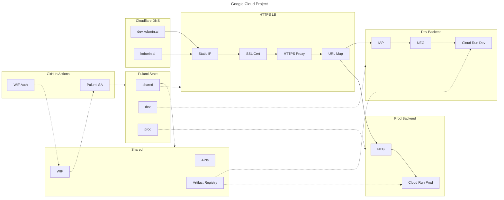
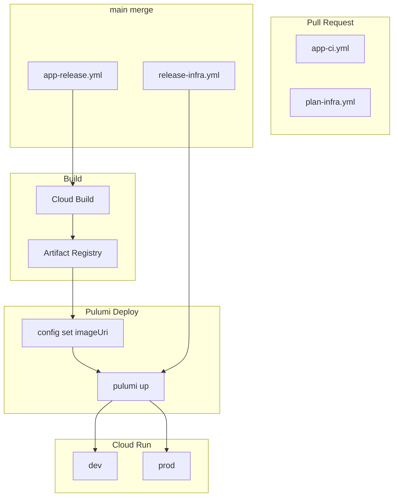

import { Image } from 'astro:assets';
import RichLinkCard from '../../../../components/RichLinkCard.astro';
import gcsImage from '../../../../assets/tech/koborin-ai-architecture/gcs.png';
import dnsImage from '../../../../assets/tech/koborin-ai-architecture/dns.png';
import iap1Image from '../../../../assets/tech/koborin-ai-architecture/iap-1.png';
import iap2Image from '../../../../assets/tech/koborin-ai-architecture/iap-2.png';


このサイト [koborin.ai](https://koborin.ai) は、自身の技術メモや思考を発信するための個人サイト (Technical Garden) です。

この記事では、サイト全体のアーキテクチャと設計思想を紹介します。インフラとフロントエンドの両面から、なぜこの構成を選んだのかを説明していきます。

---

## 全体アーキテクチャ

まず、サイト全体の構成を俯瞰します。



### 図中の用語

| 略語 | 正式名称 | 説明 |
| --- | --- | --- |
| LB | Load Balancer | 負荷分散装置。リクエストを適切なバックエンドに振り分ける |
| NEG | Network Endpoint Group | Cloud Run サービスへの接続ポイント |
| WIF | Workload Identity Federation | GitHub Actions から Google Cloud への認証 |
| IAP | Identity-Aware Proxy | Google アカウントによるアクセス制御 |

### ポイント

- **DNS（Cloudflare）→ Global HTTPS LB → Cloud Run（dev/prod）** というリクエストパス
- **dev 環境は IAP で保護** + `X-Robots-Tag: noindex` で検索エンジンにインデックスされない
- **GitHub Actions → Workload Identity Federation → Cloud Build / Pulumi** で CI/CD を実現

---

## 設計思想

このサイトを作るにあたって考えたことを、インフラとフロントエンドの両面から説明します。

### インフラ設計

#### 1 つの Google Cloud プロジェクト + 3 スタック

例えば、医療系や金融系のシステムでは、以下のような厳格な要件があり、**Google Cloud プロジェクト自体を分ける**のが一般的です：

- 監査証跡やログの完全分離
- 「誰が管理画面を触れるか」の権限分離
- コンプライアンス要件への対応

今回は個人サイトなので、そこまでの厳格さは不要です。

ただし、**開発者体験として dev/prod の区分けは欲しい**。
本番環境で直接試すのはリスクが大きいですし、変更を確認してからリリースしたいという気持ちがあります。

そこで、**コストと運用負担を抑えるため Google Cloud project は 1 つ** にして、その中でリソース（主に Cloud Run）を dev 用 / prod 用で分けるアプローチを採用しました。

#### IaC における State

Pulumi や Terraform などの IaC ツールでは、「現在どのリソースがデプロイされているか」を追跡するために **State（状態）** というファイルを管理します。

State は下記のような役割を持ちます：

- リソースの現在状態を記録：「このリソースは作成済み」「このリソースは削除された」などを追跡
- 差分検出の基準：コードの変更と State を比較して、何を作成/更新/削除すべきかを判断
- チーム開発での同期：State をリモートに保存することで、複数人が同じインフラを操作できる

このサイトでは、Pulumi の State を GCS（Google Cloud Storage）に保存しています。
スタックごとに別ファイルとして保存されるため、以下のような構成になっています。

<Image src={gcsImage} alt="gcs" width={750} quality={80} />

`shared.json`、`dev.json`、`prod.json` がそれぞれのスタックの State ファイルです。

#### shared / dev / prod の責務

| Stack | 責務 |
| --- | --- |
| `shared` | 共通リソース (LB, WIF, Artifact Registry, Managed SSL Cert) |
| `dev` | 開発用 Cloud Run サービス `koborin-ai-web-dev` |
| `prod` | 本番用 Cloud Run サービス `koborin-ai-web-prod` |

ここで `shared` は「環境」というよりも、**共通リソースをまとめる State の境界**として機能しています。

LB は 1 つで、ホストベースのルーティングをするので、dev / prod どちらから見ても共通のリソースになります。
Artifact Registry や Workload Identity Federation も同様に環境を跨いで使うため、shared に配置するのが自然です。

#### IaC フレームワークの変更: CDKTF → Pulumi Go

このサイトの IaC は、当初 **CDK for Terraform（CDKTF）** で書いていました。

<RichLinkCard href="https://github.com/hashicorp/terraform-cdk" title="hashicorp/terraform-cdk: Define infrastructure resources using programming languages" description="CDK for Terraform (CDKTF) allows you to define infrastructure using familiar programming languages." />

インフラをコード管理しつつ、TypeScript で **型安全** に Terraform リソースを定義できる点が気に入っていました。

しかし、2025/12/10 に CDKTF は **sunset / archived（開発終了）** になりました。

> Terraform CDK (CDKTF) will sunset and be archived on December 10, 2025. HashiCorp, an IBM Company, will no longer maintain or develop the project after that date.

移行先として **Pulumi Go** を選びました。理由は以下の通りです：

1. **Go が好き**：Go を書く機会が増えてきており、インフラコードも Go で統一できるのは嬉しい
2. **同じ "コードで書く IaC" の文脈**：CDKTF と同様に、プログラミング言語でインフラを定義できる
3. **既存の設計を崩しにくい**：リソースの構造や考え方は似ているので、移行コストが比較的低い

<RichLinkCard href="https://www.pulumi.com/docs/iac/languages-sdks/go/" title="Go | Pulumi Docs" description="Pulumi supports writing your infrastructure as code using Go." />

### フロントエンド設計

#### 自前の API / DB は不要

個人サイトとして、以下のような要件を考えました：

- 技術メモや思考を Markdown（MDX）で書いて公開したい
- 動的なデータ取得やユーザー認証は不要
- できるだけシンプルに運用したい

この要件であれば、**自前の API サーバーやデータベースは不要**です。コンテンツは静的に生成すれば十分です。

#### GitHub を CMS として活用

私自身エンジニアなので、CMS（WordPress や Notion など）を使わなくても、**GitHub リポジトリで直接 MDX ファイルを管理**すれば十分です。

- 記事の作成・編集は Git でバージョン管理
- PR ベースでレビューやプレビューが可能
- CI/CD で自動的にビルド・デプロイ

これにより、別途データベースを用意する必要がなくなり、運用コストを抑えられます。

#### Starlight の採用

フレームワークの選定にあたって、[genkit.dev](https://genkit.dev) のサイト構成を参考にしました。genkit.dev は Starlight を使っており、ドキュメントサイトとして洗練された UX を提供しています。

<RichLinkCard href="https://starlight.astro.build/" title="Starlight" description="Build beautiful, accessible, high-performance documentation websites with Astro." />

Starlight を選んだ理由：

- **Astro ベース**：静的サイト生成に特化しており、パフォーマンスが良い
- **多言語対応**：英語と日本語の両方でコンテンツを提供できる
- **ドキュメント向け機能**：サイドバー、検索、ダークモードなどが標準装備
- **MDX サポート**：React コンポーネントを Markdown 内で使える

---

## リクエストパス

ここからは、ユーザーがサイトにアクセスするときの流れを説明します。

### 1. DNS 解決 (Cloudflare)

ドメインはもともと Cloudflare で取得していたので、Cloudflare の A レコードで `koborin.ai` と `dev.koborin.ai` が Google Cloud 側の静的 IP を向くように設定しています。
※ DNS は Cloudflare のコンソールから手動で設定しています。

<Image src={dnsImage} alt="dns" width={750} quality={80} />

### 2. Global HTTPS Load Balancer

静的 IP にアクセスが来ると、**Global HTTPS Load Balancer** が受け取ります。

LB は **URL Map** を使って、ホスト名に応じてトラフィックを振り分けます：

<RichLinkCard href="https://cloud.google.com/load-balancing/docs/url-map" title="URL maps overview | Load Balancing | Google Cloud" description="URL maps define matching patterns for URL-based routing of requests to the appropriate backend services." />

- `koborin.ai` → Prod Backend Service → Cloud Run `koborin-ai-web-prod`
- `dev.koborin.ai` → Dev Backend Service → Cloud Run `koborin-ai-web-dev`

### 3. IAP によるアクセス制御

`dev.koborin.ai` にアクセスした場合、**Identity-Aware Proxy（IAP）** が前段で認証を行います。

<RichLinkCard href="https://cloud.google.com/iap/docs/concepts-overview" title="IAP overview | Identity-Aware Proxy | Google Cloud" description="Identity-Aware Proxy (IAP) lets you establish a central authorization layer for applications accessed by HTTPS." />

私の Google アカウントだけがアクセスを許可されており、それ以外のユーザーはブロックされます。

<table>
  <thead>
    <tr><th>状態</th><th>イメージ</th></tr>
  </thead>
  <tbody>
    <tr><td>アクセス時</td><td><Image src={iap1Image} alt="iap-1" width={400} quality={80} /></td></tr>
    <tr><td>アクセス拒否時</td><td><Image src={iap2Image} alt="iap-2" width={400} quality={80} /></td></tr>
  </tbody>
</table>

さらに、dev 環境のレスポンスには `X-Robots-Tag: noindex, nofollow` ヘッダーを付与しているため、万が一アクセスできたとしても検索エンジンにはインデックスされません。

---

## サイト機能

ここでは、このサイトが提供している機能を紹介します。

### llms.txt

このサイトでは、`/llms.txt` で LLM 向けのコンテキストファイルを提供しています。

| ファイル | 内容 |
| --- | --- |
| `/llms.txt` | 全バリアントへのリンク一覧 |
| `/llms-full.txt` | 英語記事すべて (Markdown 本文込み) |
| `/llms-ja-full.txt` | 日本語記事すべて (Markdown 本文込み) |
| `/llms-tech.txt`, `/llms-ja-tech.txt` | Tech カテゴリのみ |
| `/llms-life.txt`, `/llms-ja-life.txt` | Life カテゴリのみ |

```text
# koborin.ai
> Personal site + technical garden.

## Full (with article content)
- https://koborin.ai/llms-full.txt
- https://koborin.ai/llms-ja-full.txt

## By Category

### Tech
- https://koborin.ai/llms-tech.txt
- https://koborin.ai/llms-ja-tech.txt

### Life
- https://koborin.ai/llms-life.txt
- https://koborin.ai/llms-ja-life.txt
```

OSS プロジェクトの `llms.txt` は、「プロジェクトの概要や使い方を LLM に理解してもらう」という目的で公開されていることが多いです。
これはとても有用で、LLM がライブラリやフレームワークを正しく扱うためのコンテキストを提供しています。

個人サイトの場合は、また別の使い方ができると考えています。
自分の思考や技術メモが蓄積されていく（少なくとも現時点ではその想定。。続けたい。。笑）ので、将来「過去に自分が何を考えていたか」を LLM に参照してもらうような場面で役立つと考えています。

そういった可能性を見据えて、記事本文を含む形式で公開しています。

### Engagement Features

記事ページには、読者とのエンゲージメントを促進する機能を実装しています。

#### Giscus（コメント）

[Giscus](https://giscus.app) は、GitHub Discussions をバックエンドとしたコメントシステムです。

- 読者は GitHub アカウントでログインしてコメントやリアクションが可能
- コメントは GitHub Discussions に保存されるため、別途データベース不要
- サイトのダークモード/ライトモードに自動追従

#### Webmention（外部からのメンション）

[Webmention](https://webmention.io) は、W3C 標準の IndieWeb プロトコルです。

- 他のサイトやブログからこの記事へのリンクを検知
- Mastodon などの SNS からの「いいね」や「リポスト」を集約
- 外部サービス経由でメンション数を表示

#### Share Buttons（シェア）

記事を SNS でシェアするためのボタンを用意しています：

- X（旧 Twitter）
- Bluesky
- Mastodon
- はてなブックマーク
- リンクコピー

これらの機能は、**frontmatter に `publishedAt` がある記事ページのみ**に表示されます。インデックスページや一般的なドキュメントページには表示されません。

---

## CI/CD

CI/CD は GitHub Actions で実現しています。



### App のデプロイ

| トリガー | ワークフロー | 処理内容 |
| --- | --- | --- |
| PR 時 | `app-ci.yml` | lint / typecheck / build の検証 |
| main マージ時 | `app-release.yml` | Cloud Build → Artifact Registry → `pulumi up` |
| `app-v*` タグ | `app-release.yml` | 上記と同じ（prod 環境へデプロイ） |

### Infra のデプロイ

| トリガー | ワークフロー | 処理内容 |
| --- | --- | --- |
| PR 時 | `plan-infra.yml` | `pulumi preview` で変更内容を確認 |
| main マージ時 | `release-infra.yml` | `pulumi up` でインフラを適用 |
| `infra-v*` タグ | `release-infra.yml` | 上記と同じ（prod 環境へ適用） |

App のデプロイも Infra のデプロイも、最終的には **Pulumi を通じて Cloud Run の設定を更新**しています。

`gcloud run deploy` コマンドを直接使うのではなく、以下のフローを採用しています：

1. Cloud Build で Docker イメージをビルドし、Artifact Registry にプッシュ
2. `pulumi config set imageUri <新しいイメージURI>` で Pulumi の設定を更新
3. `pulumi up` で Cloud Run サービスのイメージを差し替え

このアプローチにより、インフラの状態が常に Pulumi の State と一致します。
手動で `gcloud run deploy` を実行すると State との乖離が発生する可能性がありますが、Pulumi 経由であればその心配がありません。

### 変更タイプによる CI の最適化

このサイトでは、PR の変更内容に応じて CI の実行範囲を調整する仕組みを導入しています。

この考え方は、t-wada さんが [開発生産性カンファレンス 2025](https://dev-productivity-con.findy-code.io/2025#special-sessions) で紹介されていた **Behavior Change（振る舞いの変更）** と **Structure Change（構造の変更）** の区別を参考にしています。

<RichLinkCard href="https://www.oreilly.com/library/view/tidy-first/9781098151232/" title="Tidy First?: A Personal Exercise in Empirical Software Design" description="By Kent Beck. Messy code is a nuisance. Tidying code, to make it more readable, requires breaking it up into manageable sections." />

元ネタは Kent Beck の著書 "Tidy First?" で、コードの変更を「振る舞いの変更」と「構造の変更」に分けて考えることで、レビューの負荷を下げ、変更の意図を明確にするというアプローチです。

#### 別案件での経験

以前、会社の別の案件でフルスタック開発をした際にも、AI エージェント向けのガードレールの 1 つとして Playwright で E2E テストを構築したことがあります。

そのプロジェクトでも `app` と `infra` を分離しており、`app/` 配下のコードが変更されたら CI を実行するというルールにしていました。
しかし、E2E テストを CI に組み込んだ結果、**実行時間が 13 分**にまで膨らみ、CI がとてつもないボトルネックとなってしまいました。

問題は、UI に影響がないとわかりきっている変更（例えばモデルのフィールド追加やリファクタリング）でも、毎回フル E2E テストが走ってしまっていたことです。
**変更の性質に応じてテスト範囲を絞るべきだった**、という学びを得ました。

#### ラベルによる分岐

この経験を踏まえ、koborin.ai では PR ラベルによって CI の実行ステップを分岐させています。

| ラベル | 意味 | CI の挙動 |
| --- | --- | --- |
| `change:behavior` | 振る舞いの変更（UI/出力/設定が変わる） | フルチェック（lint + build + audit） |
| `change:structure` | 構造の変更（リファクタ/フォーマット） | 軽量チェック（lint のみ） |

GitHub Actions では、PR のラベルを判定してステップを分岐しています：

```yaml
- name: Determine change type (labels)
  id: change-type
  run: |
    if [[ "${{ contains(github.event.pull_request.labels.*.name, 'change:structure') }}" == "true" ]]; then
      echo "type=structure" >> "$GITHUB_OUTPUT"
    else
      echo "type=behavior" >> "$GITHUB_OUTPUT"
    fi

- name: Build
  if: steps.change-type.outputs.type == 'behavior'
  working-directory: app
  run: npm run build
```

デフォルトは `behavior`（フルチェック）として、明示的に `change:structure` ラベルが付いている場合のみ軽量チェックに切り替えます。

#### AI エージェント向けの明文化

この変更タイプの区別は、AI エージェントが PR を作成する際にも活用しています。

`AGENTS.md` に以下のような定義を記載しておくことで、AI が変更内容を見て適切なラベルを判断できるようにしています：

- **Behavior Change**：`app/src/content/docs/` 配下のコンテンツ変更、`astro.config.mjs` や `Dockerfile` の変更、Pulumi スタックの変更など
- **Structure Change**：`README.md` や `AGENTS.md` の更新、コメントのみの変更、リファクタリングなど

まだ運用が定着するまでには時間がかかりそうですが、**「どこまで CI を回すか」を変更の性質に応じて調整する**という考え方は、開発体験の改善に効果があると感じています。

### Workload Identity Federation

すべてのワークフローで **Workload Identity Federation** を使っているため、サービスアカウントキーを GitHub Secrets に保存する必要がありません。

GitHub Actions の OIDC トークンを使って Google Cloud に認証し、事前に設定したサービスアカウントを借用（impersonate）する仕組みです。

<RichLinkCard href="https://cloud.google.com/iam/docs/workload-identity-federation" title="Workload Identity Federation | IAM Documentation | Google Cloud" description="Workload identity federation lets you grant on-premises or multi-cloud workloads access to Google Cloud resources." />

---

## 実装詳細

ここからは、具体的な実装内容を紹介します。興味のある方はアコーディオンを開いてご覧ください。

### Stack 別インフラ実装

<RichLinkCard href="https://github.com/nozomi-koborinai/koborin-ai/tree/main/infra" title="koborin-ai/infra at main · nozomi-koborinai/koborin-ai" description="Pulumi Go stacks for koborin.ai infrastructure (shared, dev, prod)." />

#### infra/stacks/shared.go

共通リソースを定義しています：

- **API の有効化**：Cloud Run, Compute, IAM, Artifact Registry, IAP など
- **Artifact Registry**：コンテナイメージの保存場所
- **Global Static IP**：PREMIUM tier の静的 IP
- **Managed SSL Certificate**：`koborin.ai` と `dev.koborin.ai` のマルチドメイン証明書
- **URL Map**：ホスト名ベースのルーティング
- **Backend Services**：dev（IAP 有効）と prod（IAP なし）
- **Serverless NEG**：Cloud Run サービスへの接続（サービス名を文字列で参照することで循環依存を回避）
- **Workload Identity Federation**：GitHub Actions からの認証用

<details>
<summary>`shared.go` のコードを見る</summary>

```go
package stacks

import (
	"strings"

	"github.com/pulumi/pulumi-gcp/sdk/v8/go/gcp/artifactregistry"
	"github.com/pulumi/pulumi-gcp/sdk/v8/go/gcp/compute"
	"github.com/pulumi/pulumi-gcp/sdk/v8/go/gcp/iam"
	"github.com/pulumi/pulumi-gcp/sdk/v8/go/gcp/iap"
	"github.com/pulumi/pulumi-gcp/sdk/v8/go/gcp/projects"
	"github.com/pulumi/pulumi-gcp/sdk/v8/go/gcp/serviceaccount"
	"github.com/pulumi/pulumi/sdk/v3/go/pulumi"
	"github.com/pulumi/pulumi/sdk/v3/go/pulumi/config"
)

// Shared creates resources for the shared stack.
func Shared(ctx *pulumi.Context) error {
	cfg := config.New(ctx, "")
	gcpCfg := config.New(ctx, "gcp")

	projectID := gcpCfg.Require("project")
	projectNumber := cfg.Require("projectNumber")
	iapUser := cfg.Require("iapUser")
	oauthClientID := cfg.Require("oauthClientId")
	oauthClientSecret := cfg.RequireSecret("oauthClientSecret")

	// ========================================
	// Enable Required APIs
	// ========================================

	requiredAPIs := []string{
		"run.googleapis.com",
		"compute.googleapis.com",
		"iam.googleapis.com",
		"cloudresourcemanager.googleapis.com",
		"artifactregistry.googleapis.com",
		"cloudbuild.googleapis.com",
		"iap.googleapis.com",
		"monitoring.googleapis.com",
		"logging.googleapis.com",
		"certificatemanager.googleapis.com",
	}

	var apiServices []pulumi.Resource
	for _, api := range requiredAPIs {
		logicalName := "api-" + strings.ReplaceAll(api, ".", "-")
		svc, err := projects.NewService(ctx, logicalName, &projects.ServiceArgs{
			Project:                  pulumi.String(projectID),
			Service:                  pulumi.String(api),
			DisableDependentServices: pulumi.Bool(false),
			DisableOnDestroy:         pulumi.Bool(false),
		})
		if err != nil {
			return err
		}
		apiServices = append(apiServices, svc)
	}

	// ========================================
	// Artifact Registry
	// ========================================

	_, err := artifactregistry.NewRepository(ctx, "artifact-registry", &artifactregistry.RepositoryArgs{
		Project:      pulumi.String(projectID),
		Location:     pulumi.String("asia-northeast1"),
		RepositoryId: pulumi.String("koborin-ai-web"),
		Description:  pulumi.String("Container images for koborin.ai web application (dev/prod)"),
		Format:       pulumi.String("DOCKER"),
		DockerConfig: &artifactregistry.RepositoryDockerConfigArgs{
			ImmutableTags: pulumi.Bool(true),
		},
	}, pulumi.DependsOn(apiServices))
	if err != nil {
		return err
	}

	// ========================================
	// Global Static IP
	// ========================================

	staticIP, err := compute.NewGlobalAddress(ctx, "global-ip", &compute.GlobalAddressArgs{
		Project:     pulumi.String(projectID),
		Name:        pulumi.String("koborin-ai-global-ip"),
		AddressType: pulumi.String("EXTERNAL"),
		IpVersion:   pulumi.String("IPV4"),
		Description: pulumi.String("Static IP for koborin.ai HTTPS load balancer"),
	}, pulumi.DependsOn(apiServices))
	if err != nil {
		return err
	}

	// ========================================
	// Dev Environment Backend
	// ========================================

	devNEG, err := compute.NewRegionNetworkEndpointGroup(ctx, "dev-neg", &compute.RegionNetworkEndpointGroupArgs{
		Project:             pulumi.String(projectID),
		Region:              pulumi.String("asia-northeast1"),
		Name:                pulumi.String("koborin-ai-dev-neg"),
		NetworkEndpointType: pulumi.String("SERVERLESS"),
		CloudRun: &compute.RegionNetworkEndpointGroupCloudRunArgs{
			Service: pulumi.String("koborin-ai-web-dev"),
		},
	}, pulumi.DependsOn(apiServices))
	if err != nil {
		return err
	}

	devBackend, err := compute.NewBackendService(ctx, "dev-backend", &compute.BackendServiceArgs{
		Project:              pulumi.String(projectID),
		Name:                 pulumi.String("koborin-ai-dev-backend"),
		Protocol:             pulumi.String("HTTP"),
		LoadBalancingScheme:  pulumi.String("EXTERNAL_MANAGED"),
		TimeoutSec:           pulumi.Int(30),
		CustomResponseHeaders: pulumi.StringArray{pulumi.String("X-Robots-Tag: noindex, nofollow")},
		Backends: compute.BackendServiceBackendArray{
			&compute.BackendServiceBackendArgs{
				Group:          devNEG.ID(),
				BalancingMode:  pulumi.String("UTILIZATION"),
				CapacityScaler: pulumi.Float64(1.0),
			},
		},
		Iap: &compute.BackendServiceIapArgs{
			Enabled:            pulumi.Bool(true),
			Oauth2ClientId:     pulumi.String(oauthClientID),
			Oauth2ClientSecret: oauthClientSecret,
		},
	}, pulumi.DependsOn([]pulumi.Resource{devNEG}))
	if err != nil {
		return err
	}

	_, err = iap.NewWebBackendServiceIamBinding(ctx, "dev-iap-access", &iap.WebBackendServiceIamBindingArgs{
		Project:           pulumi.String(projectID),
		WebBackendService: devBackend.Name,
		Role:              pulumi.String("roles/iap.httpsResourceAccessor"),
		Members:           pulumi.StringArray{pulumi.Sprintf("user:%s", iapUser)},
	}, pulumi.DependsOn([]pulumi.Resource{devBackend}))
	if err != nil {
		return err
	}

	// ========================================
	// Prod Environment Backend
	// ========================================

	prodNEG, err := compute.NewRegionNetworkEndpointGroup(ctx, "prod-neg", &compute.RegionNetworkEndpointGroupArgs{
		Project:             pulumi.String(projectID),
		Region:              pulumi.String("asia-northeast1"),
		Name:                pulumi.String("koborin-ai-prod-neg"),
		NetworkEndpointType: pulumi.String("SERVERLESS"),
		CloudRun: &compute.RegionNetworkEndpointGroupCloudRunArgs{
			Service: pulumi.String("koborin-ai-web-prod"),
		},
	}, pulumi.DependsOn(apiServices))
	if err != nil {
		return err
	}

	prodBackend, err := compute.NewBackendService(ctx, "prod-backend", &compute.BackendServiceArgs{
		Project:             pulumi.String(projectID),
		Name:                pulumi.String("koborin-ai-prod-backend"),
		Protocol:            pulumi.String("HTTP"),
		LoadBalancingScheme: pulumi.String("EXTERNAL_MANAGED"),
		TimeoutSec:          pulumi.Int(30),
		Backends: compute.BackendServiceBackendArray{
			&compute.BackendServiceBackendArgs{
				Group:          prodNEG.ID(),
				BalancingMode:  pulumi.String("UTILIZATION"),
				CapacityScaler: pulumi.Float64(1.0),
			},
		},
		LogConfig: &compute.BackendServiceLogConfigArgs{
			Enable:     pulumi.Bool(true),
			SampleRate: pulumi.Float64(1.0),
		},
	}, pulumi.DependsOn([]pulumi.Resource{prodNEG}))
	if err != nil {
		return err
	}

	// ========================================
	// HTTPS Load Balancer
	// ========================================

	sslCert, err := compute.NewManagedSslCertificate(ctx, "managed-cert", &compute.ManagedSslCertificateArgs{
		Project: pulumi.String(projectID),
		Name:    pulumi.String("koborin-ai-cert"),
		Managed: &compute.ManagedSslCertificateManagedArgs{
			Domains: pulumi.StringArray{
				pulumi.String("koborin.ai"),
				pulumi.String("dev.koborin.ai"),
			},
		},
	}, pulumi.DependsOn(apiServices))
	if err != nil {
		return err
	}

	urlMap, err := compute.NewURLMap(ctx, "url-map", &compute.URLMapArgs{
		Project:        pulumi.String(projectID),
		Name:           pulumi.String("koborin-ai-url-map"),
		Description:    pulumi.String("Routes traffic to dev/prod backends based on host header"),
		DefaultService: prodBackend.ID(),
		HostRules: compute.URLMapHostRuleArray{
			&compute.URLMapHostRuleArgs{
				Hosts:       pulumi.StringArray{pulumi.String("koborin.ai")},
				PathMatcher: pulumi.String("prod-matcher"),
			},
			&compute.URLMapHostRuleArgs{
				Hosts:       pulumi.StringArray{pulumi.String("dev.koborin.ai")},
				PathMatcher: pulumi.String("dev-matcher"),
			},
		},
		PathMatchers: compute.URLMapPathMatcherArray{
			&compute.URLMapPathMatcherArgs{
				Name:           pulumi.String("prod-matcher"),
				DefaultService: prodBackend.ID(),
			},
			&compute.URLMapPathMatcherArgs{
				Name:           pulumi.String("dev-matcher"),
				DefaultService: devBackend.ID(),
			},
		},
	}, pulumi.DependsOn([]pulumi.Resource{devBackend, prodBackend}))
	if err != nil {
		return err
	}

	httpsProxy, err := compute.NewTargetHttpsProxy(ctx, "https-proxy", &compute.TargetHttpsProxyArgs{
		Project: pulumi.String(projectID),
		Name:    pulumi.String("koborin-ai-https-proxy"),
		UrlMap:  urlMap.ID(),
		SslCertificates: pulumi.StringArray{
			sslCert.ID(),
		},
	}, pulumi.DependsOn([]pulumi.Resource{urlMap, sslCert}))
	if err != nil {
		return err
	}

	_, err = compute.NewGlobalForwardingRule(ctx, "forwarding-rule", &compute.GlobalForwardingRuleArgs{
		Project:             pulumi.String(projectID),
		Name:                pulumi.String("koborin-ai-forwarding-rule"),
		Target:              httpsProxy.ID(),
		PortRange:           pulumi.String("443"),
		IpProtocol:          pulumi.String("TCP"),
		LoadBalancingScheme: pulumi.String("EXTERNAL_MANAGED"),
		NetworkTier:         pulumi.String("PREMIUM"),
		IpAddress:           staticIP.Address,
	}, pulumi.DependsOn([]pulumi.Resource{httpsProxy, staticIP}))
	if err != nil {
		return err
	}

	// ========================================
	// Workload Identity (for GitHub Actions)
	// ========================================

	workloadIdentityPool, err := iam.NewWorkloadIdentityPool(ctx, "github-actions-pool", &iam.WorkloadIdentityPoolArgs{
		Project:                pulumi.String(projectID),
		WorkloadIdentityPoolId: pulumi.String("github-actions-pool"),
		DisplayName:            pulumi.String("github-actions-pool"),
		Description:            pulumi.String("Workload Identity Pool for GitHub Actions workflows"),
	})
	if err != nil {
		return err
	}

	_, err = iam.NewWorkloadIdentityPoolProvider(ctx, "github-provider", &iam.WorkloadIdentityPoolProviderArgs{
		Project:                        pulumi.String(projectID),
		WorkloadIdentityPoolId:         workloadIdentityPool.WorkloadIdentityPoolId,
		WorkloadIdentityPoolProviderId: pulumi.String("actions-firebase-provider"),
		DisplayName:                    pulumi.String("github-actions-provider"),
		Description:                    pulumi.String("GitHub Actions OIDC provider"),
		AttributeCondition: pulumi.String(`assertion.repository_owner == "nozomi-koborinai"`),
		AttributeMapping: pulumi.StringMap{
			"google.subject":             pulumi.String("assertion.repository"),
			"attribute.repository_owner": pulumi.String("assertion.repository_owner"),
		},
		Oidc: &iam.WorkloadIdentityPoolProviderOidcArgs{
			IssuerUri: pulumi.String("https://token.actions.githubusercontent.com"),
		},
	})
	if err != nil {
		return err
	}

	githubActionsSA, err := serviceaccount.NewAccount(ctx, "github-actions-sa", &serviceaccount.AccountArgs{
		Project:     pulumi.String(projectID),
		AccountId:   pulumi.String("github-actions-service"),
		DisplayName: pulumi.String("github-actions-service"),
		Description: pulumi.String("Service account for GitHub Actions to deploy via Pulumi"),
	})
	if err != nil {
		return err
	}

	_, err = serviceaccount.NewIAMMember(ctx, "github-wif-user", &serviceaccount.IAMMemberArgs{
		ServiceAccountId: githubActionsSA.Name,
		Role:             pulumi.String("roles/iam.workloadIdentityUser"),
		Member: pulumi.Sprintf(
			"principal://iam.googleapis.com/projects/%s/locations/global/workloadIdentityPools/%s/subject/nozomi-koborinai/koborin-ai",
			projectNumber,
			workloadIdentityPool.WorkloadIdentityPoolId,
		),
	})
	if err != nil {
		return err
	}

	deployerRoles := []string{
		"roles/artifactregistry.admin",
		"roles/cloudbuild.builds.builder",
		"roles/cloudbuild.builds.viewer",
		"roles/run.admin",
		"roles/compute.admin",
		"roles/iap.admin",
		"roles/logging.admin",
		"roles/logging.viewer",
		"roles/monitoring.admin",
		"roles/resourcemanager.projectIamAdmin",
		"roles/iam.serviceAccountUser",
		"roles/iam.serviceAccountAdmin",
		"roles/iam.workloadIdentityPoolAdmin",
		"roles/serviceusage.serviceUsageAdmin",
		"roles/storage.objectAdmin",
	}

	for _, role := range deployerRoles {
		logicalName := "deployer-sa-" + strings.ReplaceAll(strings.ReplaceAll(role, ".", "-"), "/", "-")
		_, err = projects.NewIAMMember(ctx, logicalName, &projects.IAMMemberArgs{
			Project: pulumi.String(projectID),
			Role:    pulumi.String(role),
			Member:  pulumi.Sprintf("serviceAccount:%s", githubActionsSA.Email),
		})
		if err != nil {
			return err
		}
	}

	return nil
}
```

</details>

#### infra/stacks/dev.go

開発環境の Cloud Run サービスを定義しています：

- **Cloud Run Service**：`koborin-ai-web-dev`
- **IAM**：IAP Service Agent に `roles/run.invoker` を付与

<details>
<summary>`dev.go` のコードを見る</summary>

```go
package stacks

import (
	"fmt"

	"github.com/pulumi/pulumi-gcp/sdk/v8/go/gcp/cloudrunv2"
	"github.com/pulumi/pulumi/sdk/v3/go/pulumi"
	"github.com/pulumi/pulumi/sdk/v3/go/pulumi/config"
)

func Dev(ctx *pulumi.Context) error {
	cfg := config.New(ctx, "")
	gcpCfg := config.New(ctx, "gcp")

	projectID := gcpCfg.Require("project")
	projectNumber := cfg.Require("projectNumber")
	imageURI := cfg.Require("imageUri")

	webDev, err := cloudrunv2.NewService(ctx, "web-dev", &cloudrunv2.ServiceArgs{
		Project:  pulumi.String(projectID),
		Location: pulumi.String("asia-northeast1"),
		Name:     pulumi.String("koborin-ai-web-dev"),
		Ingress:  pulumi.String("INGRESS_TRAFFIC_INTERNAL_LOAD_BALANCER"),
		Template: &cloudrunv2.ServiceTemplateArgs{
			ExecutionEnvironment: pulumi.String("EXECUTION_ENVIRONMENT_GEN2"),
			Containers: cloudrunv2.ServiceTemplateContainerArray{
				&cloudrunv2.ServiceTemplateContainerArgs{
					Image: pulumi.String(imageURI),
					Envs: cloudrunv2.ServiceTemplateContainerEnvArray{
						&cloudrunv2.ServiceTemplateContainerEnvArgs{
							Name:  pulumi.String("NODE_ENV"),
							Value: pulumi.String("development"),
						},
						&cloudrunv2.ServiceTemplateContainerEnvArgs{
							Name:  pulumi.String("NEXT_PUBLIC_ENV"),
							Value: pulumi.String("dev"),
						},
					},
				},
			},
			Scaling: &cloudrunv2.ServiceTemplateScalingArgs{
				MinInstanceCount: pulumi.Int(0),
				MaxInstanceCount: pulumi.Int(1),
			},
		},
		Traffics: cloudrunv2.ServiceTrafficArray{
			&cloudrunv2.ServiceTrafficArgs{
				Type:    pulumi.String("TRAFFIC_TARGET_ALLOCATION_TYPE_LATEST"),
				Percent: pulumi.Int(100),
			},
		},
	})
	if err != nil {
		return err
	}

	_, err = cloudrunv2.NewServiceIamMember(ctx, "web-dev-iap-invoker", &cloudrunv2.ServiceIamMemberArgs{
		Project:  pulumi.String(projectID),
		Location: pulumi.String("asia-northeast1"),
		Name:     webDev.Name,
		Role:     pulumi.String("roles/run.invoker"),
		Member:   pulumi.String(fmt.Sprintf("serviceAccount:service-%s@gcp-sa-iap.iam.gserviceaccount.com", projectNumber)),
	})
	if err != nil {
		return err
	}

	return nil
}
```

</details>

#### infra/stacks/prod.go

本番環境の Cloud Run サービスを定義しています：

- **Cloud Run Service**：`koborin-ai-web-prod`
- **IAM**：`allUsers` に `roles/run.invoker` を付与（パブリックアクセス）

<details>
<summary>`prod.go` のコードを見る</summary>

```go
package stacks

import (
	"github.com/pulumi/pulumi-gcp/sdk/v8/go/gcp/cloudrunv2"
	"github.com/pulumi/pulumi/sdk/v3/go/pulumi"
	"github.com/pulumi/pulumi/sdk/v3/go/pulumi/config"
)

func Prod(ctx *pulumi.Context) error {
	cfg := config.New(ctx, "")
	gcpCfg := config.New(ctx, "gcp")

	projectID := gcpCfg.Require("project")
	imageURI := cfg.Require("imageUri")

	webProd, err := cloudrunv2.NewService(ctx, "web-prod", &cloudrunv2.ServiceArgs{
		Project:  pulumi.String(projectID),
		Location: pulumi.String("asia-northeast1"),
		Name:     pulumi.String("koborin-ai-web-prod"),
		Ingress:  pulumi.String("INGRESS_TRAFFIC_INTERNAL_LOAD_BALANCER"),
		Template: &cloudrunv2.ServiceTemplateArgs{
			ExecutionEnvironment: pulumi.String("EXECUTION_ENVIRONMENT_GEN2"),
			Containers: cloudrunv2.ServiceTemplateContainerArray{
				&cloudrunv2.ServiceTemplateContainerArgs{
					Image: pulumi.String(imageURI),
					Envs: cloudrunv2.ServiceTemplateContainerEnvArray{
						&cloudrunv2.ServiceTemplateContainerEnvArgs{
							Name:  pulumi.String("NODE_ENV"),
							Value: pulumi.String("production"),
						},
						&cloudrunv2.ServiceTemplateContainerEnvArgs{
							Name:  pulumi.String("NEXT_PUBLIC_ENV"),
							Value: pulumi.String("prod"),
						},
					},
				},
			},
			Scaling: &cloudrunv2.ServiceTemplateScalingArgs{
				MinInstanceCount: pulumi.Int(0),
				MaxInstanceCount: pulumi.Int(10),
			},
		},
		Traffics: cloudrunv2.ServiceTrafficArray{
			&cloudrunv2.ServiceTrafficArgs{
				Type:    pulumi.String("TRAFFIC_TARGET_ALLOCATION_TYPE_LATEST"),
				Percent: pulumi.Int(100),
			},
		},
	})
	if err != nil {
		return err
	}

	_, err = cloudrunv2.NewServiceIamMember(ctx, "web-prod-invoker", &cloudrunv2.ServiceIamMemberArgs{
		Project:  pulumi.String(projectID),
		Location: pulumi.String("asia-northeast1"),
		Name:     webProd.Name,
		Role:     pulumi.String("roles/run.invoker"),
		Member:   pulumi.String("allUsers"),
	})
	if err != nil {
		return err
	}

	return nil
}
```

</details>

### App 実装

<RichLinkCard href="https://github.com/nozomi-koborinai/koborin-ai/tree/main/app" title="koborin-ai/app at main · nozomi-koborinai/koborin-ai" description="Astro + Starlight application for koborin.ai." />

#### app/astro.config.mjs

Astro と Starlight の設定ファイルです：

- **多言語対応**：`root`（英語）と `ja`（日本語）
- **サイドバー**：`app/src/sidebar.ts` からインポート
- **カスタムコンポーネント**：Head, ThemeSelect, Header, Sidebar, Pagination

<details>
<summary>`astro.config.mjs` のコードを見る</summary>

```javascript
import { defineConfig } from "astro/config";
import starlight from "@astrojs/starlight";
import rehypeMermaid from "rehype-mermaid";
import { sidebar } from "./src/sidebar.ts";

export default defineConfig({
  site: "https://koborin.ai",
  srcDir: "src",
  markdown: {
    rehypePlugins: [
      [
        rehypeMermaid,
        {
          strategy: "inline-svg",
          mermaidConfig: { theme: "neutral" },
        },
      ],
    ],
  },
  integrations: [
    starlight({
      title: "koborin.ai",
      defaultLocale: "root",
      locales: {
        root: { label: "English", lang: "en" },
        ja: { label: "日本語" },
      },
      description: "Personal site + technical garden",
      favicon: "/favicon.png",
      logo: {
        src: "./src/assets/_shared/koborin-ai-header.webp",
        replacesTitle: true,
      },
      social: [
        { label: "GitHub", icon: "github", href: "https://github.com/nozomi-koborinai" },
        { label: "LinkedIn", icon: "linkedin", href: "https://linkedin.com/in/nozomi-koborinai" },
        { label: "X", icon: "x.com", href: "https://x.com/fender_kn" },
        { label: "Medium", icon: "document", href: "https://medium.com/@nozomi-koborinai" },
      ],
      sidebar,
      customCss: ['./src/styles/custom.css'],
      components: {
        Head: './src/components/Head.astro',
        ThemeSelect: './src/components/ThemeSelect.astro',
        Header: './src/components/SiteHeader.astro',
        Sidebar: './src/components/Sidebar.astro',
        Pagination: './src/components/Pagination.astro',
      },
      head: [
        { tag: 'meta', attrs: { name: 'twitter:card', content: 'summary_large_image' } },
      ],
      disable404Route: true,
    }),
  ],
});
```

</details>

#### app/Dockerfile

マルチステージビルドで、静的サイトを nginx で配信します：

1. **Build stage**：Node.js で OG 画像最適化 → `astro build`
2. **Runtime stage**：`nginx:alpine` で静的ファイルを配信

<details>
<summary>`Dockerfile` のコードを見る</summary>

```dockerfile
# Build stage
FROM node:22-slim AS build
WORKDIR /app

RUN apt-get update && apt-get install -y \
    libnss3 libnspr4 libdbus-1-3 libatk1.0-0 libatk-bridge2.0-0 \
    libcups2 libdrm2 libxkbcommon0 libxcomposite1 libxdamage1 \
    libxfixes3 libxrandr2 libgbm1 libasound2 libpango-1.0-0 \
    libcairo2 webp imagemagick file \
    && rm -rf /var/lib/apt/lists/*

COPY package*.json ./
RUN npm install
RUN npx playwright install chromium
COPY . .

RUN ./scripts/optimize-og-images.sh
RUN npm run build

# Runtime stage
FROM nginx:alpine AS runtime
COPY ./nginx/nginx.conf /etc/nginx/nginx.conf
COPY --from=build /app/dist /usr/share/nginx/html
EXPOSE 8080
```

</details>

#### app/nginx/nginx.conf

nginx の設定です：

- **Port 8080**：Cloud Run の要件に合わせて
- **UTF-8 charset**：`llms.txt` の文字化け対策
- **キャッシュ設定**：`/_astro/` は 1 年間、OG 画像は 7 日間
- **WebP 自動配信**：`/og/*.png` へのリクエストを `.webp` に解決

<details>
<summary>`nginx.conf` のコードを見る</summary>

```nginx
worker_processes  1;

events {
  worker_connections  1024;
}

http {
  server {
    listen 8080;
    server_name   _;

    root   /usr/share/nginx/html;
    index  index.html index.htm;
    include /etc/nginx/mime.types;

    charset utf-8;
    charset_types text/plain text/css application/json;

    gzip on;
    gzip_min_length 1000;
    gzip_proxied expired no-cache no-store private auth;
    gzip_types text/plain text/css application/json application/javascript text/xml application/xml text/javascript;

    error_page 404 /404.html;
    location = /404.html { root /usr/share/nginx/html; internal; }

    location /_astro/ { expires 1y; add_header Cache-Control "public, immutable"; }

    location ~ ^/og/(.+)\.(png|jpe?g)$ {
      set $webp_file /og/$1.webp;
      try_files $webp_file $uri =404;
      expires 7d;
      add_header Cache-Control "public";
    }

    location /og/ { expires 7d; add_header Cache-Control "public"; }
    location = /favicon.png { expires 30d; add_header Cache-Control "public"; }
    location / { try_files $uri $uri/index.html =404; }
  }
}
```

</details>

---

## まとめ

- **シンプルな構成**：個人サイトなので GCP プロジェクトは 1 つに集約
- **開発者体験の確保**：dev/prod を分離し、IAP で開発環境を保護
- **フロントエンド**：API/DB 不要、GitHub を CMS として活用、Starlight で構築
- **CDKTF → Pulumi Go への移行**：sunset リスクを回避しつつ、好みの言語で統一
- **Behavior / Structure の意識**：変更の性質に応じて CI の実行範囲を調整
- **サイト機能**：llms.txt と Engagement Features（Giscus, Webmention, Share buttons）で読者とつながる

## koborin.ai 開発リポジトリ

<RichLinkCard href="https://github.com/nozomi-koborinai/koborin-ai" title="koborin-ai" description="🪴 A repository for building personal homepages and technical garden on GCP" />
