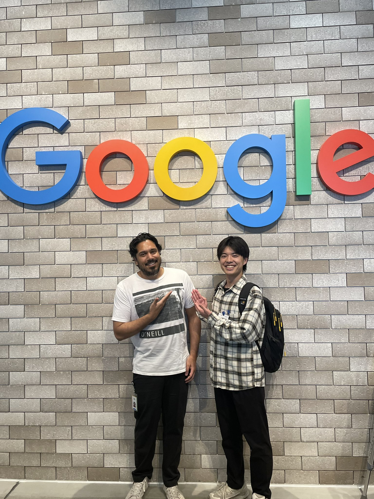

2025 was a turbulent year for me—someone who had mostly stayed at home until now.
First trip abroad, a major life stage change, co-authoring a book with an engineer from overseas, publishing it, and getting promoted at my main job.
Through all of this, my mental model has been shifting significantly. I'm writing this blog to organize my thoughts.

## 1. Google Cloud Next '25

This year, I attended [Google Cloud Next '25](https://cloud.withgoogle.com/next/25), the celebration of GCP technology.
At the time, I was interested in serverless products, so I got to talk with Google engineers working on Cloud Run, Identity Platform, and Firebase products.

Originally, I planned to give them a feature request for their product.
But when I was actually standing in front of them, I couldn't say anything.
I was still learning English, and I couldn't get even a fraction of what was in my head into words.
I just stood there in silence. It was frustrating. Embarrassing, really.

But I couldn't hide my excitement at meeting the product manager of products I use and love every day. In the end, all I could say was "I love your product!"
Still, maybe that feeling got through. At least, I want to believe it did.
I was happy that [Dmitry Lyalin](https://www.linkedin.com/in/dmitrylyalin/), who worked on Google's AI development framework [Genkit](https://genkit.dev/) and now leads the Gemini CLI product, seemed to sense something from my broken English.

"Improving developer experience is my greatest joy and motivation."
I desperately tried to convey this using a translation app.
That if I can contribute to OSS and spread technical articles to let engineers around the world know about these technologies, I'd be happy.

Then I was introduced to [Sumit Chandel](https://www.linkedin.com/in/sumit-chandel-a273792/), a DevRel based in Japan, and after returning home, I was even invited to an office tour.

I realized that even if you can't speak the language well, you can still connect through emotion.
After that, my passion didn't cool down, and I kept contributing to [Medium](https://medium.com/@nozomi-koborinai) and the [Awesome list](https://github.com/xavidop/awesome-genkit).

## 2. Co-authoring a Book

Then I got a direct message from [Xavi Portilla](https://www.linkedin.com/in/xavierportillaedo/), a GDE (Google Developer Experts) in the AI field based in Spain, asking if I wanted to write a book about Genkit together.

The OSS world is really fascinating. I never expected it to lead to encounters and activities like this.

At the time, only the JavaScript (TypeScript) version of Genkit was GA, but we decided to release `Mastering Genkit: Go Edition` ahead of Genkit for Go, which was scheduled for GA in late October 2025. I learned a lot from a promotional perspective too.
The time difference between Spain and Japan is about 7 hours. For about 4 months, I had days where I significantly cut into my sleep.
Honestly, there were many tough moments. But for me, living as an engineer, it was even more fun than it was hard.

I learned so much from Xavi.
Especially "the attitude of taking time to deliver something good to people."
No need to rush—when there are big changes, taking time leads to delivering better results.
He gave me very straightforward advice on the structure of what I wrote and how to structure it as an English book.

[Mastering Genkit: Go Edition](https://www.amazon.com/dp/B0G4HKJRPB)

In an era where AI keeps advancing, I think we should put our own thinking and philosophy into what we create.
Through co-authoring with Xavi, I was able to practice that, and getting it out into the world was a good experience.

## 3. Work

There was a big change at work too.
Since this year, I've been leading a team of 4 people.
I set aside 1 hour every week for 1-on-1s to listen to my team members.

This isn't about giving technical direction as a development lead or project manager.
Team members are assigned to different company projects, so they're basically scattered.
That's exactly why I think there needs to be a place to talk about mental health, everyday work concerns, what technical areas they want to pursue, what career paths they want to choose, and what projects they want to be involved in.
The team includes designers, engineers who want to focus on frontend, and engineers aiming for SRE.

I'll say it again—no matter how much AI advances, I don't think human dialogue will disappear.
Through conversations with people, my mental model gets strengthened, and I started thinking about where both myself and the other person would feel most comfortable, and what kind of world I should show them for their growth.
Before I knew it, something like parental affection had sprouted in me. (Somehow.)

People have environments they've lived in for decades, and those environments are reflected in their humanity. That's why conversations with people are interesting.
I also receive perspectives that others take for granted, and I feel like I'm learning about how people relate to each other more than I did in my early 20s.

And when I put what I've experienced into words and share it with them, they try to understand—even if they don't fully get it.
That makes me happy, even if it's a bit selfish of me.
I hope we can keep influencing each other and grow both as engineers and as human beings.

## 4. Community

There's an engineer community called [Flutter University](https://flutteruniv.com/).
I've been a member for over 3 and a half years now.
I'm involved in some operations like being a 1-on-1 mentor for new members, but basically I participate as a regular member.
I post in my personal channel, spread knowledge from other communities like Genkit to Flutter, and occasionally speak at events run by Flutter University.

This community is mostly engineers from different companies.
It's relatively easy to consult about my own concerns, and if there's an interesting event, I can invite people or get invited—it's very active.
Right now, I'm working on a project to build an AI agent application.

I felt that the engineering world is vast because I joined this community.
Deciding to move to Tokyo, landing a fulfilling job after changing companies, enjoying private OSS activities, and the book authorship—all of it happened because of this community.

In 2026, Flutter University is going through a rebranding, and I want to contribute to its growth as a way of giving back.

## 5. The Person Who Supported Me

This year, there was a major life stage change.
There's someone who supported my challenges from the closest distance.
I can't go into too much detail, but at Google Cloud Next, when I could barely speak or understand English, they stood between me and Google engineers at the Firebase booth to interpret.
During the 4 months when I was cutting into my sleep for the book, they understood my personality of "not being satisfied until I reach a good stopping point" while still caring most about my health.

They stayed by my side even knowing my struggles and my weird obsessions.
I can't express how much I've been supported. I'm always grateful.

## Closing

2025 is just the starting point for building my career going forward.
The me who can't speak English, the me who cuts into sleep to immerse myself in work, the me who's awakening to parental feelings toward team members, the me who realizes the importance of the person supporting me from beside.
This was a year of discovering that version of myself.

In 2026, I want to reach even higher. In my private life and work, as an engineer and as a person, I want to face even more people and environments.
