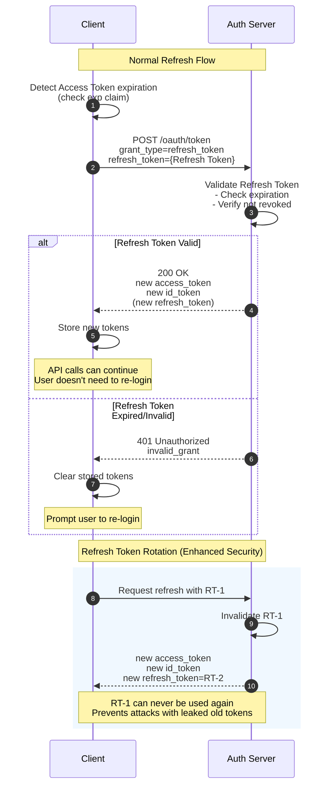

> **Note:** This article is a personal study note from when I was researching Firebase Auth tokens. It's more of a compilation of what I learned during the process rather than a comprehensive guide.

This guide covers the fundamentals of authentication tokens in OAuth 2.0 / OpenID Connect, with a focus on Firebase Auth's unique characteristics.

---

## 1. Authentication vs Authorization

| Concept | Description | Examples |
|---------|-------------|----------|
| **Authentication** | Verifying "who you are" | Login process, password verification, SAML authentication |
| **Authorization** | Verifying "what you can do" | Admin permission check, group membership verification |

- Authentication comes first, then authorization. An unauthenticated user cannot be authorized.

---

## 2. Token Types and Roles

### 2.1 Tokens in OAuth 2.0 / OpenID Connect

| Token | Purpose | Content | Usage Location | Typical Validity |
|-------|---------|---------|----------------|------------------|
| **ID Token** | User identification | UID, email, name, etc. | Frontend | 5 min - 1 hour |
| **Access Token** | Resource access authorization | Scopes, permissions | Backend API | 5 min - 1 hour |
| **Refresh Token** | Token renewal | Random string | Token refresh requests | 7 - 90 days |

### 2.2 ID Token

- **Purpose**: Prove "who this person is"
- **Usage**: Consumed within the client (frontend)
- **Use cases**: Display username, show profile, personalize UI
- **Format**: JWT (JSON Web Token)

### 2.3 Access Token

- **Purpose**: Prove "authorization to access this resource"
- **Usage**: Sent to backend API (`Authorization: Bearer {token}`)
- **Use cases**: API authorization, resource access control
- **Format**: JWT or Opaque Token

### 2.4 Refresh Token

- **Purpose**: Obtain new ID Token / Access Token
- **Usage**: Token refresh requests to the auth server
- **Use cases**: Get new tokens when Access Token expires, without re-login
- **Format**: Opaque Token (contents not visible)

---

## 3. JWT (JSON Web Token) Structure

ID Tokens and Access Tokens are often created in JWT format. A JWT consists of three parts:

```
eyJhbGciOiJSUzI1NiIsInR5cCI6IkpXVCJ9.eyJpc3MiOiJodHRwczovL...
├──────────── Header ────────────┤├────────── Payload ──────────...
```

### 3.1 Header

```json
{
  "alg": "RS256",
  "typ": "JWT"
}
```

- `alg`: Signature algorithm
- `typ`: Token type

### 3.2 Payload = Collection of Claims

```json
{
  "iss": "https://securetoken.google.com/my-project",
  "sub": "XeOK4KBxyz123abc",
  "aud": "my-project",
  "iat": 1704067200,
  "exp": 1704070800,
  "email": "user@example.com",
  "firebase": {
    "sign_in_provider": "password"
  }
}
```

| Claim | Meaning |
|-------|---------|
| `iss` | Issuer |
| `sub` | Subject = User ID (UID) |
| `aud` | Audience = Project ID |
| `iat` | Issued At (timestamp) |
| `exp` | Expiration (timestamp) |
| `email` | Email address |

### 3.3 Signature

- Header and Payload are signed with a private key
- If tampered with, the signature won't match
- Server-side verification via `verifyIdToken()` etc.

---

## 4. OAuth 2.0 / OpenID Connect Flow

### 4.1 Token Acquisition Timing

Upon successful authentication, **ID Token / Access Token / Refresh Token are issued simultaneously** in a single response:

```json
{
  "access_token": "eyJhbG...",
  "token_type": "Bearer",
  "expires_in": 3600,
  "refresh_token": "dGhpcyB...",
  "id_token": "eyJhbGci..."
}
```

### 4.2 Validity Period Management

- **Auth server decides**: The auth server (IdP) sets all token validity periods
- **For JWTs**: The `exp` claim contains the expiration timestamp
- **Configurability**: Varies by provider - some allow developer configuration, others don't

### 4.3 Token Refresh Flow



- When Access Token expires, use Refresh Token to get new tokens
- **A single Refresh Token refreshes both ID Token and Access Token**
- User doesn't need to re-login

---

## 5. Firebase Auth Characteristics

### 5.1 ID Token Serves as Access Token

| Aspect | Standard OAuth 2.0 | Firebase Auth |
|--------|-------------------|---------------|
| Token types | ID Token + Access Token | **ID Token only** |
| API authentication | Uses Access Token | **Uses ID Token** |
| Management complexity | Manage 2 types | Manage 1 type |

- In Firebase, ID Token handles both "authentication" and "authorization"
- Simpler for developers - only one token type to manage

### 5.2 Token Validity Periods

| Item | Firebase Auth |
|------|---------------|
| ID Token validity | **1 hour (fixed, not configurable)** |
| Refresh Token validity | **Virtually unlimited** |

Firebase Refresh Token is invalidated only when:

- User is deleted
- User is disabled
- Password or email address is changed
- `revokeRefreshTokens(uid)` is explicitly called

### 5.3 SDK Types and Usage

#### Client-side SDK (Automatic Refresh Token Usage)

| SDK | Use Case |
|-----|----------|
| Firebase JavaScript SDK (`firebase/auth`) | Web apps |
| Firebase iOS SDK | iOS apps |
| Firebase Android SDK | Android apps |
| Firebase Flutter SDK | Cross-platform apps |

- Just call `user.getIdToken()` - automatically refreshes when expired
- Developers don't need to handle Refresh Token directly

#### Server-side Admin SDK (Refresh Token Management/Revocation)

| SDK | Use Case |
|-----|----------|
| Firebase Admin SDK for Node.js | Server-side |
| Firebase Admin SDK for Python | Server-side |
| Firebase Admin SDK for Java | Server-side |
| Firebase Admin SDK for Go | Server-side |

- Cannot directly access Refresh Token
- Can only invalidate via `revokeRefreshTokens(uid)`

### 5.4 User Experience and Security Balance

| Perspective | What It Looks Like |
|-------------|-------------------|
| **User's view** | "I'm always logged in" |
| **Internal behavior** | ID Token expires every hour and gets renewed as needed |

**Why this design?**

| Aspect | Reason |
|--------|--------|
| **Short ID Token (1 hour)** | Even if leaked, becomes invalid after 1 hour (limits damage) |
| **Long Refresh Token (virtually unlimited)** | Users don't want to log in repeatedly (UX priority) |
| **SDK auto-refresh** | Security and UX balance without developer effort |

Firebase Auth achieves "**security-wise tokens change every hour, but UX-wise the user stays logged in**".

---

## 6. Browser Storage Types

Where to store tokens and session information involves security vs. convenience trade-offs.

### 6.1 Storage Types Overview

| Storage | Lifetime | Cross-tab | Auto-sent to Server | JS Access | Capacity |
|---------|----------|-----------|---------------------|-----------|----------|
| **Session Storage** | Until tab closes | No | No | Yes | ~5MB |
| **Local Storage** | Persistent (until deleted) | Yes | No | Yes | ~5MB |
| **Cookie** | Set via maxAge/expires | Yes | **Yes** | Blocked by httpOnly | ~4KB |
| **IndexedDB** | Persistent | Yes | No | Yes | Large |

### 6.2 Session Storage

- **Storage location**: Browser (Web Storage API)
- **Lifetime**: Until tab/window closes
- **Scope**: Same tab only (not shared across tabs)
- **Use cases**: Temporary data (UI state needed only while logged in)

```javascript
// Store
sessionStorage.setItem('key', 'value');
// Retrieve
const value = sessionStorage.getItem('key');
// Delete
sessionStorage.removeItem('key');
```

### 6.3 Local Storage

- **Storage location**: Browser (Web Storage API)
- **Lifetime**: Persistent until explicitly deleted
- **Scope**: Shared within same origin (across all tabs)
- **Use cases**: User settings, cache data

```javascript
// Store
localStorage.setItem('key', 'value');
// Retrieve
const value = localStorage.getItem('key');
// Delete
localStorage.removeItem('key');
```

### 6.4 Cookie

- **Storage location**: Browser
- **Lifetime**: Set via maxAge/expires
- **Scope**: Same origin (subdomains configurable)
- **Key feature**: **Automatically sent to server with requests**
- **Use cases**: Auth tokens, session management

```javascript
// Set (server-side)
response.cookies.set('name', 'value', {
  httpOnly: true,  // JS cannot access
  secure: true,    // HTTPS only
  sameSite: 'lax', // CSRF protection
  maxAge: 86400,   // 1 day (seconds)
});
```

### 6.5 IndexedDB

- **Storage location**: Browser (NoSQL database)
- **Lifetime**: Persistent until explicitly deleted
- **Scope**: Within same origin
- **Use cases**: Large data, offline data, **Firebase SDK token storage**

Firebase Auth SDK automatically stores ID Token and Refresh Token in IndexedDB:

```
IndexedDB: firebaseLocalStorageDb
  └─ firebaseLocalStorage
      └─ firebase:authUser:{apiKey}:{appName}
```

### 6.6 Token Storage Location Selection

| Storage Location | XSS Attack Risk | Recommended Use |
|------------------|-----------------|-----------------|
| Session Storage | Can be stolen | Temporary data |
| Local Storage | Can be stolen | Non-sensitive data |
| **Cookie (httpOnly)** | **Cannot be read by JS** | **Auth tokens (recommended)** |
| IndexedDB | Can be stolen | Firebase SDK default |
| Memory only | Lost on page navigation | Most secure but inconvenient |

### 6.7 Session Storage vs Session Cookie

These have similar names but completely different mechanisms:

| Aspect | Session Storage | Session Cookie |
|--------|-----------------|----------------|
| Manager | Browser | Server issues → Browser stores |
| Lifetime | Until tab closes | Server-defined (5 min - 14 days) |
| Server transmission | Manual | Automatic |
| httpOnly | Not available (always JS accessible) | Configurable |
| Use case | Temporary UI state | Auth session management |

---

## 7. Session Cookie (Firebase Auth Context)

### 7.1 Cookie Types (General Definition)

Cookies are classified into 2 types based on expiration settings:

| Type | Expiration Setting | Disappears When | Use Case |
|------|-------------------|-----------------|----------|
| **Session Cookie** | None (`maxAge`/`expires` not set) | Browser closes | Temporary session info |
| **Persistent Cookie** | Set (`maxAge`/`expires` defined) | Expiration reached | Maintain login state |

### 7.2 Firebase Auth's "Session Cookie"

In Firebase Auth documentation, "Session Cookie" has a **different meaning** from the general definition:

| Aspect | General Session Cookie | Firebase Auth Session Cookie |
|--------|------------------------|------------------------------|
| Definition | Cookie without `maxAge`/`expires` | Cookie issued by `createSessionCookie()` |
| Lifetime | Until browser closes | **5 min - 14 days (configurable)** |
| Technical classification | Session Cookie | **Persistent Cookie** |
| Use case | Temporary session | Server-side session management |

**In other words, Firebase's "Session Cookie" is technically a Persistent Cookie.**

### 7.3 Session Cookie Overview (Firebase Context)

Firebase Auth Session Cookie is a mechanism for managing user sessions server-side. Send ID Token to server, convert it to Session Cookie, then use Cookie-based auth for subsequent requests.

| Aspect | ID Token Direct Usage | Session Cookie Usage |
|--------|----------------------|---------------------|
| Storage | Client (memory/IndexedDB) | Server issues → Browser Cookie |
| Validity | 1 hour (fixed) | 5 min - 14 days (configurable) |
| Refresh | Client SDK automatic | Server-side explicit renewal |
| Security | JavaScript accessible | httpOnly blocks JavaScript access |

### 7.4 Creating Session Cookie (Firebase Admin SDK)

```typescript
// Server-side: Receive ID Token and issue Session Cookie
const expiresIn = 60 * 60 * 24 * 1000; // 1 day (milliseconds)

// Verify ID Token and create Session Cookie
const sessionCookie = await adminAuth.createSessionCookie(idToken, { expiresIn });

// Set Cookie in response
response.cookies.set('__session', sessionCookie, {
  httpOnly: true,    // JavaScript cannot access (XSS protection)
  secure: true,      // HTTPS only
  sameSite: 'lax',   // CSRF protection
  maxAge: expiresIn / 1000,
  path: '/',
});
```

### 7.5 Verifying Session Cookie

```typescript
// Server-side: Verify Session Cookie
const sessionCookie = cookies().get('__session')?.value;
const decodedClaims = await adminAuth.verifySessionCookie(sessionCookie, true);
// Access decodedClaims.uid, decodedClaims.email, etc.
```

### 7.6 Security Flags

| Flag | Value | Effect |
|------|-------|--------|
| `httpOnly` | `true` | JavaScript cannot access (XSS protection) |
| `secure` | `true` | Cookie sent only over HTTPS |
| `sameSite` | `lax` | Only send Cookie for same-site requests (CSRF protection) |
| `maxAge` | seconds | Cookie validity period |
| `path` | `/` | Path where Cookie is valid |

### 7.7 Session Cookie Validity

| Item | Value |
|------|-------|
| Minimum | 5 minutes (300,000 milliseconds) |
| Maximum | 14 days (1,209,600,000 milliseconds) |
| Configuration | `expiresIn` option in `createSessionCookie()` |

### 7.8 ID Token Direct Usage vs Session Cookie

| Aspect | ID Token Direct Usage | Session Cookie |
|--------|----------------------|----------------|
| **Implementation complexity** | Simple | More complex (Cookie management needed) |
| **Validity flexibility** | 1 hour fixed | 5 min - 14 days configurable |
| **XSS resistance** | Lower (JS accessible) | Higher (httpOnly) |
| **CSRF resistance** | Higher (explicit header required) | Protected by sameSite |
| **Refresh** | SDK automatic | Manual refresh process needed |
| **SSR support** | Additional implementation needed | Cookie auto-sent |

#### Detailed Security Comparison

**XSS Attack Resistance**

| Method | Storage Location | XSS Risk |
|--------|------------------|----------|
| Session Cookie | Cookie (httpOnly) | JS cannot read. However, Cookie is auto-sent, so attacker could potentially call APIs |
| ID Token Direct Usage | IndexedDB / Memory | Risk of theft via `localStorage.getItem()` or IndexedDB. Can be obtained via Firebase SDK's `getIdToken()` |

**CSRF Attack Resistance**

| Method | Transmission | CSRF Resistance |
|--------|--------------|-----------------|
| Session Cookie | Auto-sent (Cookie) | `sameSite: 'lax'` limits to same-site requests. However, may be sent for GET requests |
| ID Token Direct Usage | Explicit (`Authorization: Bearer`) | Not auto-sent in CSRF, so higher resistance |

**Token Leakage Impact**

| Method | Validity | Mitigation |
|--------|----------|------------|
| Session Cookie | 1 day (configurable) | Invalidated after 1 day. Can call `revokeRefreshTokens()` server-side for immediate invalidation |
| ID Token Direct Usage | 1 hour (fixed) | Invalidated after 1 hour. However, if Refresh Token leaks, long-term impact (Firebase is virtually unlimited) |

**Decision Points**

| Aspect | ID Token Direct Usage Suits When | Session Cookie Suits When |
|--------|----------------------------------|---------------------------|
| XSS risk tolerance | Internal portal with low XSS risk | Want to minimize XSS risk |
| CSRF risk tolerance | Want complete CSRF prevention | No sensitive operations on GET requests |
| Implementation/maintenance cost | Want simplicity | Prioritize security |
| Token leakage impact | 1-hour invalidation is acceptable | 1-day validity is acceptable |

**Reference Documentation**:
- [OWASP - Cross-Site Scripting (XSS)](https://owasp.org/www-community/attacks/xss/)
- [OWASP - Cross-Site Request Forgery (CSRF)](https://owasp.org/www-community/attacks/csrf)

### 7.9 ID Token Direct Usage Method

Instead of using Session Cookie, send ID Token directly to API. Leverages Firebase SDK's auto-refresh feature.

**Characteristics**:

| Item | Content |
|------|---------|
| Session Cookie | Not needed (not created) |
| Session refresh | Not needed (SDK auto-manages) |
| API calls | Explicitly send via `Authorization: Bearer {idToken}` |
| Server verification | Use `verifyIdToken()` |

**API Call Example**:

```typescript
// Client-side
const user = auth.currentUser;
const idToken = await user.getIdToken(); // Auto-refresh if near expiration

const response = await fetch('/api/data', {
  headers: {
    'Authorization': `Bearer ${idToken}`,
  },
});
```

**Server-side Verification**:

```typescript
// API Route
const authHeader = request.headers.get('Authorization');
const idToken = authHeader?.split('Bearer ')[1];

const decodedClaims = await adminAuth.verifyIdToken(idToken);
// Access decodedClaims.uid, decodedClaims.email, etc.
```

**Changes When Migrating from Session Cookie**:

| Change Location | Content |
|-----------------|---------|
| `/api/auth/session/route.ts` | Delete or disable |
| `session-refresh.ts` | Delete (not needed) |
| Each API Route | `verifySessionCookie()` → `verifyIdToken()` |
| Client API calls | Add `Authorization: Bearer {idToken}` |

---

## 8. Provider Comparison

| Provider | ID Token | Access Token | Refresh Token | Configurable? |
|----------|----------|--------------|---------------|---------------|
| **Firebase** | 1 hour | N/A (ID Token serves both) | Virtually unlimited | No |
| **Google** | 1 hour | 1 hour | 6 months (if unused) | No |
| **Microsoft** | 1 hour | 1 hour | 90 days (default) | Yes |
| **Auth0** | 10 hours | 24 hours | 2 weeks | Yes |
| **AWS Cognito** | 1 hour | 1 hour | 1 day - 3650 days | Yes |
| **Okta** | Configurable | Configurable | Configurable | Yes |

---

## 9. Glossary

| Term | Description |
|------|-------------|
| Authentication | Identity verification |
| Authorization | Permission verification |
| ID Token | Identity certificate (JWT) |
| Access Token | Resource access rights |
| Refresh Token | For token renewal |
| Session Cookie | Cookie for server-side session management |
| UID | User ID |
| Claims | Attributes within token |
| JWT | JSON Web Token format |
| Signature | Tamper prevention |
| IdP | Identity Provider (auth server) |
| Custom Claims | Developer-added custom attributes |
| httpOnly | Cookie flag preventing JavaScript access |
| secure | Cookie flag for HTTPS-only transmission |
| sameSite | Cookie flag for CSRF protection |
| XSS | Cross-Site Scripting attack |
| CSRF | Cross-Site Request Forgery attack |
| Session Storage | Browser storage that clears on tab close |
| Local Storage | Persistently stored browser storage |
| IndexedDB | In-browser NoSQL database |
| Persistent Cookie | Cookie with set expiration (persists until expiry) |

---

## References

- [Firebase Auth - Manage User Sessions](https://firebase.google.com/docs/auth/admin/manage-sessions)
- [Firebase Auth - Manage Session Cookies](https://firebase.google.com/docs/auth/admin/manage-cookies)
- [Firebase Auth - Verify ID Tokens](https://firebase.google.com/docs/auth/admin/verify-id-tokens)
- [OAuth 2.0 RFC 6749](https://datatracker.ietf.org/doc/html/rfc6749)
- [OpenID Connect Core 1.0](https://openid.net/specs/openid-connect-core-1_0.html)
