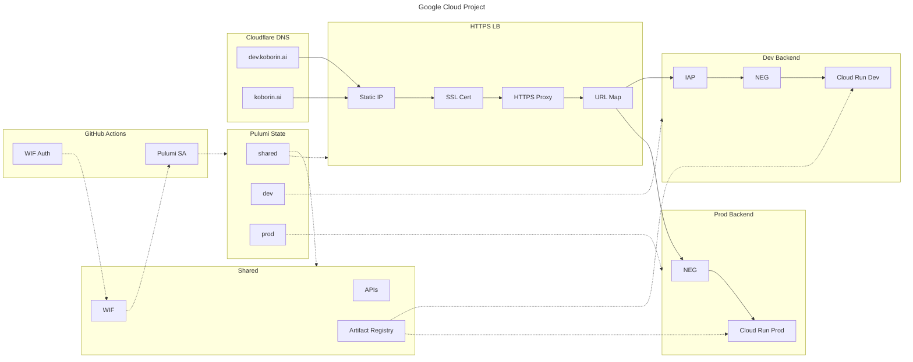
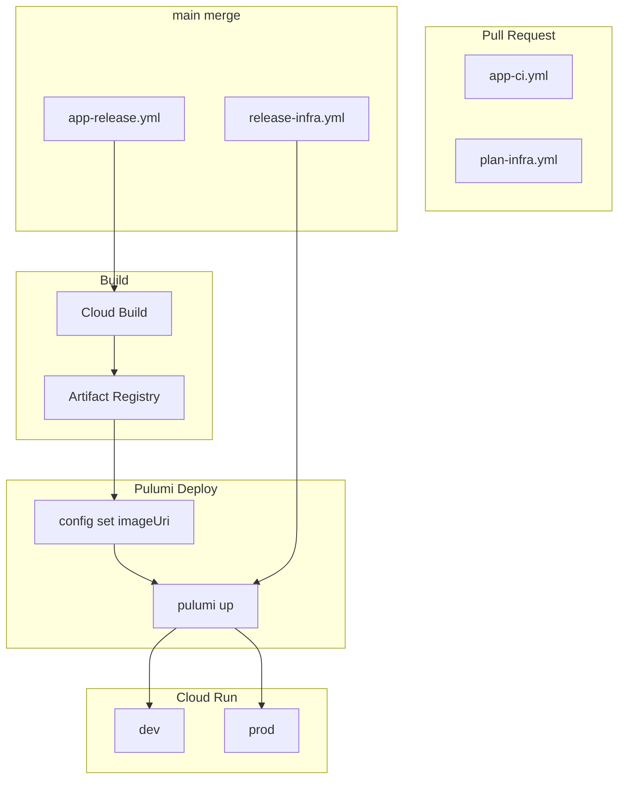

import { Image } from 'astro:assets';
import RichLinkCard from '../../../components/RichLinkCard.astro';
import gcsImage from '../../../assets/tech/koborin-ai-architecture/gcs.png';
import dnsImage from '../../../assets/tech/koborin-ai-architecture/dns.png';
import iap1Image from '../../../assets/tech/koborin-ai-architecture/iap-1.png';
import iap2Image from '../../../assets/tech/koborin-ai-architecture/iap-2.png';


This site, [koborin.ai](https://koborin.ai), is my personal site (Technical Garden) for publishing technical notes and thoughts.

This article introduces the overall architecture and design philosophy of the site. I'll explain why I chose this setup from both infrastructure and frontend perspectives.

---

## Overall Architecture

Let's start with a bird's-eye view of the site's structure.



### Terminology

| Abbreviation | Full Name | Description |
| --- | --- | --- |
| LB | Load Balancer | Distributes requests to appropriate backends |
| NEG | Network Endpoint Group | Connection point to Cloud Run services |
| WIF | Workload Identity Federation | Authentication from GitHub Actions to Google Cloud |
| IAP | Identity-Aware Proxy | Access control using Google accounts |

### Key Points

- **Request path**: DNS (Cloudflare) → Global HTTPS LB → Cloud Run (dev/prod)
- **Dev environment is protected by IAP** + `X-Robots-Tag: noindex` to prevent search engine indexing
- **CI/CD**: GitHub Actions → Workload Identity Federation → Cloud Build / Pulumi

---

## Design Philosophy

Here's what I considered when building this site, from both infrastructure and frontend perspectives.

### Infrastructure Design

#### Single Google Cloud Project + 3 Stacks

In healthcare or financial systems, strict requirements often apply, making it common to **separate GCP projects entirely**:

- Complete separation of audit trails and logs
- Strict permission separation for "who can access the admin console"
- Compliance requirements

For a personal site, such strictness is unnecessary.

However, **as a developer, I still want a dev/prod distinction**. Testing directly in production is risky, and I want to verify changes before releasing them.

So I chose to **keep costs and operational burden low by using a single GCP project**, while separating Cloud Run services into dev and prod.

#### State in IaC

IaC tools like Pulumi and Terraform manage a **State** file to track "which resources are currently deployed."

State serves the following purposes:

- **Records current resource state**: Tracks whether a resource is created, updated, or deleted
- **Baseline for diff detection**: Compares code changes against State to determine what to create/update/delete
- **Synchronization for team development**: Storing State remotely allows multiple people to operate the same infrastructure

For this site, I store Pulumi's State in GCS (Google Cloud Storage). Since each stack has its own separate file, the structure looks like this:

<Image src={gcsImage} alt="gcs" width={750} quality={80} />

`shared.json`, `dev.json`, and `prod.json` are the State files for each stack.

#### Responsibilities of shared / dev / prod

| Stack | Responsibility |
| --- | --- |
| `shared` | Common resources (LB, WIF, Artifact Registry, Managed SSL Cert) |
| `dev` | Dev Cloud Run service `koborin-ai-web-dev` |
| `prod` | Prod Cloud Run service `koborin-ai-web-prod` |

Here, `shared` functions less as an "environment" and more as a **State boundary for grouping common resources**.

Since the LB handles host-based routing for both environments, it's naturally a shared resource. The same applies to Artifact Registry and Workload Identity Federation, which are used across environments.

#### IaC Framework Migration: CDKTF → Pulumi Go

The IaC for this site was originally written in **CDK for Terraform (CDKTF)**.

<RichLinkCard href="https://github.com/hashicorp/terraform-cdk" title="hashicorp/terraform-cdk: Define infrastructure resources using programming languages" description="CDK for Terraform (CDKTF) allows you to define infrastructure using familiar programming languages." />

I liked being able to manage infrastructure as code while defining Terraform resources **type-safely** in TypeScript.

However, CDKTF was **sunset / archived** on December 10, 2025.

> Terraform CDK (CDKTF) will sunset and be archived on December 10, 2025. HashiCorp, an IBM Company, will no longer maintain or develop the project after that date.

I chose **Pulumi Go** as the migration target. Here's why:

1. **I like Go**: I've been writing more Go lately, and it's nice to unify infrastructure code in Go as well
2. **Same "write infrastructure in code" paradigm**: Like CDKTF, you can define infrastructure using a programming language
3. **Low migration cost**: The resource structure and concepts are similar, making migration relatively straightforward

<RichLinkCard href="https://www.pulumi.com/docs/iac/languages-sdks/go/" title="Go | Pulumi Docs" description="Pulumi supports writing your infrastructure as code using Go." />

### Frontend Design

#### No Need for Custom API / DB

For a personal site, I considered the following requirements:

- Write and publish technical notes and thoughts in Markdown (MDX)
- No need for dynamic data fetching or user authentication
- Keep operations as simple as possible

With these requirements, **there's no need for a custom API server or database**. Static content generation is sufficient.

#### GitHub as CMS

As an engineer myself, I don't need a CMS (like WordPress or Notion). **Managing MDX files directly in a GitHub repository** is enough.

- Article creation and editing are version-controlled with Git
- PR-based reviews and previews are possible
- CI/CD automatically builds and deploys

This eliminates the need for a separate database, reducing operational costs.

#### Adopting Starlight

When selecting a framework, I referenced the site structure of [genkit.dev](https://genkit.dev). genkit.dev uses Starlight and provides a polished UX as a documentation site.

<RichLinkCard href="https://starlight.astro.build/" title="Starlight" description="Build beautiful, accessible, high-performance documentation websites with Astro." />

Reasons for choosing Starlight:

- **Astro-based**: Specialized for static site generation with excellent performance
- **Multilingual support**: Can provide content in both English and Japanese
- **Documentation-focused features**: Sidebar, search, dark mode included by default
- **MDX support**: Can use React components within Markdown

---

## Request Path

From here, I'll explain the flow when a user accesses the site.

### 1. DNS Resolution (Cloudflare)

The domain was originally acquired through Cloudflare, so I configured **Cloudflare A records** to point `koborin.ai` and `dev.koborin.ai` to the GCP static IP.

> Note: DNS is configured manually in the Cloudflare console.

<Image src={dnsImage} alt="dns" width={750} quality={80} />

### 2. Global HTTPS Load Balancer

When traffic hits the static IP, the **Global HTTPS Load Balancer** receives it.

The LB uses a **URL Map** to route traffic based on the hostname:

<RichLinkCard href="https://cloud.google.com/load-balancing/docs/url-map" title="URL maps overview | Load Balancing | Google Cloud" description="URL maps define matching patterns for URL-based routing of requests to the appropriate backend services." />

- `koborin.ai` → Prod Backend Service → Cloud Run `koborin-ai-web-prod`
- `dev.koborin.ai` → Dev Backend Service → Cloud Run `koborin-ai-web-dev`

### 3. IAP Access Control

When accessing `dev.koborin.ai`, **Identity-Aware Proxy (IAP)** performs authentication at the front.

<RichLinkCard href="https://cloud.google.com/iap/docs/concepts-overview" title="IAP overview | Identity-Aware Proxy | Google Cloud" description="Identity-Aware Proxy (IAP) lets you establish a central authorization layer for applications accessed by HTTPS." />

Only my Google account is allowed access; all other users are blocked.

<table>
  <thead>
    <tr><th>State</th><th>Screenshot</th></tr>
  </thead>
  <tbody>
    <tr><td><code>Dev access</code></td><td><Image src={iap1Image} alt="iap-1" width={400} quality={80} /></td></tr>
    <tr><td><code>Dev access denied</code></td><td><Image src={iap2Image} alt="iap-2" width={400} quality={80} /></td></tr>
  </tbody>
</table>

Additionally, dev environment responses include the `X-Robots-Tag: noindex, nofollow` header, so even if someone could access it, it wouldn't be indexed by search engines.

---

## Site Features

Here, I'll introduce the features this site provides.

### llms.txt

This site provides LLM context files at `/llms.txt`.

| File | Content |
| --- | --- |
| `/llms.txt` | Index with links to all variants |
| `/llms-full.txt` | All English articles (with full Markdown body) |
| `/llms-ja-full.txt` | All Japanese articles (with full Markdown body) |
| `/llms-tech.txt`, `/llms-ja-tech.txt` | Tech category only |
| `/llms-life.txt`, `/llms-ja-life.txt` | Life category only |

```text
# koborin.ai
> Personal site + technical garden.

## Full (with article content)
- https://koborin.ai/llms-full.txt
- https://koborin.ai/llms-ja-full.txt

## By Category

### Tech
- https://koborin.ai/llms-tech.txt
- https://koborin.ai/llms-ja-tech.txt

### Life
- https://koborin.ai/llms-life.txt
- https://koborin.ai/llms-ja-life.txt
```

OSS projects often publish `llms.txt` to help LLMs understand "what the project is and how to use it." This is incredibly useful, providing context for LLMs to correctly work with libraries and frameworks.

For a personal site, there's a different use case. As my thoughts and technical notes accumulate over time (at least that's the plan... I hope to keep it up...), it might be useful in the future to have an LLM reference "what I was thinking in the past."

With that possibility in mind, I publish the full article body in this format.

### Engagement Features

Article pages include features to encourage engagement with readers.

#### Giscus (Comments)

[Giscus](https://giscus.app) is a comment system that uses GitHub Discussions as its backend.

- Readers can log in with their GitHub account to comment and react
- Comments are stored in GitHub Discussions, so no separate database is needed
- Automatically syncs with the site's dark/light mode

#### Webmention (External Mentions)

[Webmention](https://webmention.io) is a W3C standard IndieWeb protocol.

- Detects links to this article from other sites and blogs
- Aggregates "likes" and "reposts" from SNS like Mastodon
- Displays mention counts via an external service

#### Share Buttons

Buttons are provided for sharing articles on social media:

- X (formerly Twitter)
- Bluesky
- Mastodon
- Hatena Bookmark
- Copy Link

These features are displayed **only on article pages with `publishedAt` in the frontmatter**. They don't appear on index pages or general documentation pages.

---

## CI/CD

CI/CD is implemented with GitHub Actions.



### App Deployment

| Trigger | Workflow | Actions |
| --- | --- | --- |
| On PR | `app-ci.yml` | Validate lint / typecheck / build |
| On main merge | `app-release.yml` | Cloud Build → Artifact Registry → `pulumi up` |
| `app-v*` tag | `app-release.yml` | Same as above (deploys to prod) |

### Infra Deployment

| Trigger | Workflow | Actions |
| --- | --- | --- |
| On PR | `plan-infra.yml` | `pulumi preview` to review changes |
| On main merge | `release-infra.yml` | `pulumi up` to apply infrastructure |
| `infra-v*` tag | `release-infra.yml` | Same as above (applies to prod) |

Both App and Infra deployments ultimately **update Cloud Run through Pulumi**.

Instead of using the `gcloud run deploy` command directly, we use the following flow:

1. Cloud Build builds the Docker image and pushes it to Artifact Registry
2. `pulumi config set imageUri <new image URI>` updates the Pulumi configuration
3. `pulumi up` updates the Cloud Run service with the new image

This approach ensures that **infrastructure state always matches Pulumi's State**. Running `gcloud run deploy` manually could cause drift from the State, but going through Pulumi eliminates that concern.

### CI Optimization by Change Type

This site adjusts CI execution scope based on the nature of PR changes.

This approach is inspired by the distinction between **Behavior Change** and **Structure Change** that t-wada introduced at the Developer Productivity Conference 2025.

<RichLinkCard href="https://www.oreilly.com/library/view/tidy-first/9781098151232/" title="Tidy First?: A Personal Exercise in Empirical Software Design" description="By Kent Beck. Messy code is a nuisance. Tidying code, to make it more readable, requires breaking it up into manageable sections." />

The original source is Kent Beck's book "Tidy First?", which proposes categorizing code changes into "behavior changes" and "structure changes" to reduce review burden and clarify the intent of changes.

#### Lessons from a Previous Project

In a previous full-stack project at work, I built E2E tests with Playwright as guardrails for AI agents.

That project also separated `app` and `infra`, with a rule that CI would run whenever code under `app/` changed. However, after integrating E2E tests into CI, **execution time ballooned to 13 minutes**, turning CI into a significant bottleneck.

The problem was that even for changes that clearly had no UI impact (like adding model fields or refactoring), full E2E tests would run every time. **The lesson learned: test scope should be adjusted based on the nature of the change.**

#### Label-Based Branching

Based on this experience, koborin.ai uses PR labels to branch CI execution steps.

| Label | Meaning | CI Behavior |
| --- | --- | --- |
| `change:behavior` | Behavior change (UI/output/config changes) | Full checks (lint + build + audit) |
| `change:structure` | Structure change (refactoring/formatting) | Lightweight checks (lint only) |

GitHub Actions determines the change type from PR labels and branches accordingly:

```yaml
- name: Determine change type (labels)
  id: change-type
  run: |
    if [[ "${{ contains(github.event.pull_request.labels.*.name, 'change:structure') }}" == "true" ]]; then
      echo "type=structure" >> "$GITHUB_OUTPUT"
    else
      echo "type=behavior" >> "$GITHUB_OUTPUT"
    fi

- name: Build
  if: steps.change-type.outputs.type == 'behavior'
  working-directory: app
  run: npm run build
```

The default is `behavior` (full checks), switching to lightweight checks only when the `change:structure` label is explicitly applied.

#### Documentation for AI Agents

This change type distinction is also used when AI agents create PRs.

By documenting definitions like the following in `AGENTS.md`, AI can judge the appropriate label based on the change content:

- **Behavior Change**: Content changes under `app/src/content/docs/`, changes to `astro.config.mjs` or `Dockerfile`, Pulumi stack changes, etc.
- **Structure Change**: Updates to `README.md` or `AGENTS.md`, comment-only changes, refactoring, etc.

While it will take time for this workflow to become fully established, **adjusting CI scope based on change nature** has proven effective for improving developer experience.

### Workload Identity Federation

All workflows use **Workload Identity Federation**, so there's no need to store service account keys in GitHub Secrets.

GitHub Actions uses OIDC tokens to authenticate with Google Cloud and impersonate a pre-configured service account.

<RichLinkCard href="https://cloud.google.com/iam/docs/workload-identity-federation" title="Workload Identity Federation | IAM Documentation | Google Cloud" description="Workload identity federation lets you grant on-premises or multi-cloud workloads access to Google Cloud resources." />

---

## Implementation Details

From here, I'll introduce specific implementation details. Those interested can expand the accordions to see the code.

### Stack-Based Infrastructure Implementation

<RichLinkCard href="https://github.com/nozomi-koborinai/koborin-ai/tree/main/infra" title="koborin-ai/infra at main · nozomi-koborinai/koborin-ai" description="Pulumi Go stacks for koborin.ai infrastructure (shared, dev, prod)." />

#### infra/stacks/shared.go

Defines common resources:

- **API Enablement**: Cloud Run, Compute, IAM, Artifact Registry, IAP, etc.
- **Artifact Registry**: Container image storage
- **Global Static IP**: PREMIUM tier static IP
- **Managed SSL Certificate**: Multi-domain certificate for `koborin.ai` and `dev.koborin.ai`
- **URL Map**: Host-based routing
- **Backend Services**: dev (IAP enabled) and prod (no IAP)
- **Serverless NEG**: Connection to Cloud Run services (references service name as string to avoid circular dependencies)
- **Workload Identity Federation**: For authentication from GitHub Actions

<details>
<summary>View `shared.go` code</summary>

```go
package stacks

import (
	"strings"

	"github.com/pulumi/pulumi-gcp/sdk/v8/go/gcp/artifactregistry"
	"github.com/pulumi/pulumi-gcp/sdk/v8/go/gcp/compute"
	"github.com/pulumi/pulumi-gcp/sdk/v8/go/gcp/iam"
	"github.com/pulumi/pulumi-gcp/sdk/v8/go/gcp/iap"
	"github.com/pulumi/pulumi-gcp/sdk/v8/go/gcp/projects"
	"github.com/pulumi/pulumi-gcp/sdk/v8/go/gcp/serviceaccount"
	"github.com/pulumi/pulumi/sdk/v3/go/pulumi"
	"github.com/pulumi/pulumi/sdk/v3/go/pulumi/config"
)

func Shared(ctx *pulumi.Context) error {
	cfg := config.New(ctx, "")
	gcpCfg := config.New(ctx, "gcp")

	projectID := gcpCfg.Require("project")
	projectNumber := cfg.Require("projectNumber")
	iapUser := cfg.Require("iapUser")
	oauthClientID := cfg.Require("oauthClientId")
	oauthClientSecret := cfg.RequireSecret("oauthClientSecret")

	// Enable Required APIs
	requiredAPIs := []string{
		"run.googleapis.com",
		"compute.googleapis.com",
		"iam.googleapis.com",
		"cloudresourcemanager.googleapis.com",
		"artifactregistry.googleapis.com",
		"cloudbuild.googleapis.com",
		"iap.googleapis.com",
		"monitoring.googleapis.com",
		"logging.googleapis.com",
		"certificatemanager.googleapis.com",
	}

	var apiServices []pulumi.Resource
	for _, api := range requiredAPIs {
		logicalName := "api-" + strings.ReplaceAll(api, ".", "-")
		svc, err := projects.NewService(ctx, logicalName, &projects.ServiceArgs{
			Project:                  pulumi.String(projectID),
			Service:                  pulumi.String(api),
			DisableDependentServices: pulumi.Bool(false),
			DisableOnDestroy:         pulumi.Bool(false),
		})
		if err != nil {
			return err
		}
		apiServices = append(apiServices, svc)
	}

	// Artifact Registry
	_, err := artifactregistry.NewRepository(ctx, "artifact-registry", &artifactregistry.RepositoryArgs{
		Project:      pulumi.String(projectID),
		Location:     pulumi.String("asia-northeast1"),
		RepositoryId: pulumi.String("koborin-ai-web"),
		Description:  pulumi.String("Container images for koborin.ai web application (dev/prod)"),
		Format:       pulumi.String("DOCKER"),
		DockerConfig: &artifactregistry.RepositoryDockerConfigArgs{
			ImmutableTags: pulumi.Bool(true),
		},
	}, pulumi.DependsOn(apiServices))
	if err != nil {
		return err
	}

	// Global Static IP
	staticIP, err := compute.NewGlobalAddress(ctx, "global-ip", &compute.GlobalAddressArgs{
		Project:     pulumi.String(projectID),
		Name:        pulumi.String("koborin-ai-global-ip"),
		AddressType: pulumi.String("EXTERNAL"),
		IpVersion:   pulumi.String("IPV4"),
		Description: pulumi.String("Static IP for koborin.ai HTTPS load balancer"),
	}, pulumi.DependsOn(apiServices))
	if err != nil {
		return err
	}

	// Dev Environment Backend
	devNEG, err := compute.NewRegionNetworkEndpointGroup(ctx, "dev-neg", &compute.RegionNetworkEndpointGroupArgs{
		Project:             pulumi.String(projectID),
		Region:              pulumi.String("asia-northeast1"),
		Name:                pulumi.String("koborin-ai-dev-neg"),
		NetworkEndpointType: pulumi.String("SERVERLESS"),
		CloudRun: &compute.RegionNetworkEndpointGroupCloudRunArgs{
			Service: pulumi.String("koborin-ai-web-dev"),
		},
	}, pulumi.DependsOn(apiServices))
	if err != nil {
		return err
	}

	devBackend, err := compute.NewBackendService(ctx, "dev-backend", &compute.BackendServiceArgs{
		Project:              pulumi.String(projectID),
		Name:                 pulumi.String("koborin-ai-dev-backend"),
		Protocol:             pulumi.String("HTTP"),
		LoadBalancingScheme:  pulumi.String("EXTERNAL_MANAGED"),
		TimeoutSec:           pulumi.Int(30),
		CustomResponseHeaders: pulumi.StringArray{pulumi.String("X-Robots-Tag: noindex, nofollow")},
		Backends: compute.BackendServiceBackendArray{
			&compute.BackendServiceBackendArgs{
				Group:          devNEG.ID(),
				BalancingMode:  pulumi.String("UTILIZATION"),
				CapacityScaler: pulumi.Float64(1.0),
			},
		},
		Iap: &compute.BackendServiceIapArgs{
			Enabled:            pulumi.Bool(true),
			Oauth2ClientId:     pulumi.String(oauthClientID),
			Oauth2ClientSecret: oauthClientSecret,
		},
	}, pulumi.DependsOn([]pulumi.Resource{devNEG}))
	if err != nil {
		return err
	}

	_, err = iap.NewWebBackendServiceIamBinding(ctx, "dev-iap-access", &iap.WebBackendServiceIamBindingArgs{
		Project:           pulumi.String(projectID),
		WebBackendService: devBackend.Name,
		Role:              pulumi.String("roles/iap.httpsResourceAccessor"),
		Members:           pulumi.StringArray{pulumi.Sprintf("user:%s", iapUser)},
	}, pulumi.DependsOn([]pulumi.Resource{devBackend}))
	if err != nil {
		return err
	}

	// Prod Environment Backend
	prodNEG, err := compute.NewRegionNetworkEndpointGroup(ctx, "prod-neg", &compute.RegionNetworkEndpointGroupArgs{
		Project:             pulumi.String(projectID),
		Region:              pulumi.String("asia-northeast1"),
		Name:                pulumi.String("koborin-ai-prod-neg"),
		NetworkEndpointType: pulumi.String("SERVERLESS"),
		CloudRun: &compute.RegionNetworkEndpointGroupCloudRunArgs{
			Service: pulumi.String("koborin-ai-web-prod"),
		},
	}, pulumi.DependsOn(apiServices))
	if err != nil {
		return err
	}

	prodBackend, err := compute.NewBackendService(ctx, "prod-backend", &compute.BackendServiceArgs{
		Project:             pulumi.String(projectID),
		Name:                pulumi.String("koborin-ai-prod-backend"),
		Protocol:            pulumi.String("HTTP"),
		LoadBalancingScheme: pulumi.String("EXTERNAL_MANAGED"),
		TimeoutSec:          pulumi.Int(30),
		Backends: compute.BackendServiceBackendArray{
			&compute.BackendServiceBackendArgs{
				Group:          prodNEG.ID(),
				BalancingMode:  pulumi.String("UTILIZATION"),
				CapacityScaler: pulumi.Float64(1.0),
			},
		},
		LogConfig: &compute.BackendServiceLogConfigArgs{
			Enable:     pulumi.Bool(true),
			SampleRate: pulumi.Float64(1.0),
		},
	}, pulumi.DependsOn([]pulumi.Resource{prodNEG}))
	if err != nil {
		return err
	}

	// HTTPS Load Balancer
	sslCert, err := compute.NewManagedSslCertificate(ctx, "managed-cert", &compute.ManagedSslCertificateArgs{
		Project: pulumi.String(projectID),
		Name:    pulumi.String("koborin-ai-cert"),
		Managed: &compute.ManagedSslCertificateManagedArgs{
			Domains: pulumi.StringArray{
				pulumi.String("koborin.ai"),
				pulumi.String("dev.koborin.ai"),
			},
		},
	}, pulumi.DependsOn(apiServices))
	if err != nil {
		return err
	}

	urlMap, err := compute.NewURLMap(ctx, "url-map", &compute.URLMapArgs{
		Project:        pulumi.String(projectID),
		Name:           pulumi.String("koborin-ai-url-map"),
		Description:    pulumi.String("Routes traffic to dev/prod backends based on host header"),
		DefaultService: prodBackend.ID(),
		HostRules: compute.URLMapHostRuleArray{
			&compute.URLMapHostRuleArgs{
				Hosts:       pulumi.StringArray{pulumi.String("koborin.ai")},
				PathMatcher: pulumi.String("prod-matcher"),
			},
			&compute.URLMapHostRuleArgs{
				Hosts:       pulumi.StringArray{pulumi.String("dev.koborin.ai")},
				PathMatcher: pulumi.String("dev-matcher"),
			},
		},
		PathMatchers: compute.URLMapPathMatcherArray{
			&compute.URLMapPathMatcherArgs{
				Name:           pulumi.String("prod-matcher"),
				DefaultService: prodBackend.ID(),
			},
			&compute.URLMapPathMatcherArgs{
				Name:           pulumi.String("dev-matcher"),
				DefaultService: devBackend.ID(),
			},
		},
	}, pulumi.DependsOn([]pulumi.Resource{devBackend, prodBackend}))
	if err != nil {
		return err
	}

	httpsProxy, err := compute.NewTargetHttpsProxy(ctx, "https-proxy", &compute.TargetHttpsProxyArgs{
		Project: pulumi.String(projectID),
		Name:    pulumi.String("koborin-ai-https-proxy"),
		UrlMap:  urlMap.ID(),
		SslCertificates: pulumi.StringArray{
			sslCert.ID(),
		},
	}, pulumi.DependsOn([]pulumi.Resource{urlMap, sslCert}))
	if err != nil {
		return err
	}

	_, err = compute.NewGlobalForwardingRule(ctx, "forwarding-rule", &compute.GlobalForwardingRuleArgs{
		Project:             pulumi.String(projectID),
		Name:                pulumi.String("koborin-ai-forwarding-rule"),
		Target:              httpsProxy.ID(),
		PortRange:           pulumi.String("443"),
		IpProtocol:          pulumi.String("TCP"),
		LoadBalancingScheme: pulumi.String("EXTERNAL_MANAGED"),
		NetworkTier:         pulumi.String("PREMIUM"),
		IpAddress:           staticIP.Address,
	}, pulumi.DependsOn([]pulumi.Resource{httpsProxy, staticIP}))
	if err != nil {
		return err
	}

	// Workload Identity (for GitHub Actions)
	workloadIdentityPool, err := iam.NewWorkloadIdentityPool(ctx, "github-actions-pool", &iam.WorkloadIdentityPoolArgs{
		Project:                pulumi.String(projectID),
		WorkloadIdentityPoolId: pulumi.String("github-actions-pool"),
		DisplayName:            pulumi.String("github-actions-pool"),
		Description:            pulumi.String("Workload Identity Pool for GitHub Actions workflows"),
	})
	if err != nil {
		return err
	}

	_, err = iam.NewWorkloadIdentityPoolProvider(ctx, "github-provider", &iam.WorkloadIdentityPoolProviderArgs{
		Project:                        pulumi.String(projectID),
		WorkloadIdentityPoolId:         workloadIdentityPool.WorkloadIdentityPoolId,
		WorkloadIdentityPoolProviderId: pulumi.String("actions-firebase-provider"),
		DisplayName:                    pulumi.String("github-actions-provider"),
		Description:                    pulumi.String("GitHub Actions OIDC provider"),
		AttributeCondition: pulumi.String(`assertion.repository_owner == "nozomi-koborinai"`),
		AttributeMapping: pulumi.StringMap{
			"google.subject":             pulumi.String("assertion.repository"),
			"attribute.repository_owner": pulumi.String("assertion.repository_owner"),
		},
		Oidc: &iam.WorkloadIdentityPoolProviderOidcArgs{
			IssuerUri: pulumi.String("https://token.actions.githubusercontent.com"),
		},
	})
	if err != nil {
		return err
	}

	githubActionsSA, err := serviceaccount.NewAccount(ctx, "github-actions-sa", &serviceaccount.AccountArgs{
		Project:     pulumi.String(projectID),
		AccountId:   pulumi.String("github-actions-service"),
		DisplayName: pulumi.String("github-actions-service"),
		Description: pulumi.String("Service account for GitHub Actions to deploy via Pulumi"),
	})
	if err != nil {
		return err
	}

	_, err = serviceaccount.NewIAMMember(ctx, "github-wif-user", &serviceaccount.IAMMemberArgs{
		ServiceAccountId: githubActionsSA.Name,
		Role:             pulumi.String("roles/iam.workloadIdentityUser"),
		Member: pulumi.Sprintf(
			"principal://iam.googleapis.com/projects/%s/locations/global/workloadIdentityPools/%s/subject/nozomi-koborinai/koborin-ai",
			projectNumber,
			workloadIdentityPool.WorkloadIdentityPoolId,
		),
	})
	if err != nil {
		return err
	}

	deployerRoles := []string{
		"roles/artifactregistry.admin",
		"roles/cloudbuild.builds.builder",
		"roles/cloudbuild.builds.viewer",
		"roles/run.admin",
		"roles/compute.admin",
		"roles/iap.admin",
		"roles/logging.admin",
		"roles/logging.viewer",
		"roles/monitoring.admin",
		"roles/resourcemanager.projectIamAdmin",
		"roles/iam.serviceAccountUser",
		"roles/iam.serviceAccountAdmin",
		"roles/iam.workloadIdentityPoolAdmin",
		"roles/serviceusage.serviceUsageAdmin",
		"roles/storage.objectAdmin",
	}

	for _, role := range deployerRoles {
		logicalName := "deployer-sa-" + strings.ReplaceAll(strings.ReplaceAll(role, ".", "-"), "/", "-")
		_, err = projects.NewIAMMember(ctx, logicalName, &projects.IAMMemberArgs{
			Project: pulumi.String(projectID),
			Role:    pulumi.String(role),
			Member:  pulumi.Sprintf("serviceAccount:%s", githubActionsSA.Email),
		})
		if err != nil {
			return err
		}
	}

	return nil
}
```

</details>

#### infra/stacks/dev.go

Defines the dev environment Cloud Run service:

- **Cloud Run Service**: `koborin-ai-web-dev`
- **IAM**: Grants `roles/run.invoker` to IAP Service Agent

<details>
<summary>View `dev.go` code</summary>

```go
package stacks

import (
	"fmt"

	"github.com/pulumi/pulumi-gcp/sdk/v8/go/gcp/cloudrunv2"
	"github.com/pulumi/pulumi/sdk/v3/go/pulumi"
	"github.com/pulumi/pulumi/sdk/v3/go/pulumi/config"
)

func Dev(ctx *pulumi.Context) error {
	cfg := config.New(ctx, "")
	gcpCfg := config.New(ctx, "gcp")

	projectID := gcpCfg.Require("project")
	projectNumber := cfg.Require("projectNumber")
	imageURI := cfg.Require("imageUri")

	webDev, err := cloudrunv2.NewService(ctx, "web-dev", &cloudrunv2.ServiceArgs{
		Project:  pulumi.String(projectID),
		Location: pulumi.String("asia-northeast1"),
		Name:     pulumi.String("koborin-ai-web-dev"),
		Ingress:  pulumi.String("INGRESS_TRAFFIC_INTERNAL_LOAD_BALANCER"),
		Template: &cloudrunv2.ServiceTemplateArgs{
			ExecutionEnvironment: pulumi.String("EXECUTION_ENVIRONMENT_GEN2"),
			Containers: cloudrunv2.ServiceTemplateContainerArray{
				&cloudrunv2.ServiceTemplateContainerArgs{
					Image: pulumi.String(imageURI),
					Envs: cloudrunv2.ServiceTemplateContainerEnvArray{
						&cloudrunv2.ServiceTemplateContainerEnvArgs{
							Name:  pulumi.String("NODE_ENV"),
							Value: pulumi.String("development"),
						},
						&cloudrunv2.ServiceTemplateContainerEnvArgs{
							Name:  pulumi.String("NEXT_PUBLIC_ENV"),
							Value: pulumi.String("dev"),
						},
					},
				},
			},
			Scaling: &cloudrunv2.ServiceTemplateScalingArgs{
				MinInstanceCount: pulumi.Int(0),
				MaxInstanceCount: pulumi.Int(1),
			},
		},
		Traffics: cloudrunv2.ServiceTrafficArray{
			&cloudrunv2.ServiceTrafficArgs{
				Type:    pulumi.String("TRAFFIC_TARGET_ALLOCATION_TYPE_LATEST"),
				Percent: pulumi.Int(100),
			},
		},
	})
	if err != nil {
		return err
	}

	_, err = cloudrunv2.NewServiceIamMember(ctx, "web-dev-iap-invoker", &cloudrunv2.ServiceIamMemberArgs{
		Project:  pulumi.String(projectID),
		Location: pulumi.String("asia-northeast1"),
		Name:     webDev.Name,
		Role:     pulumi.String("roles/run.invoker"),
		Member:   pulumi.String(fmt.Sprintf("serviceAccount:service-%s@gcp-sa-iap.iam.gserviceaccount.com", projectNumber)),
	})
	if err != nil {
		return err
	}

	return nil
}
```

</details>

#### infra/stacks/prod.go

Defines the prod environment Cloud Run service:

- **Cloud Run Service**: `koborin-ai-web-prod`
- **IAM**: Grants `roles/run.invoker` to `allUsers` (public access)

<details>
<summary>View `prod.go` code</summary>

```go
package stacks

import (
	"github.com/pulumi/pulumi-gcp/sdk/v8/go/gcp/cloudrunv2"
	"github.com/pulumi/pulumi/sdk/v3/go/pulumi"
	"github.com/pulumi/pulumi/sdk/v3/go/pulumi/config"
)

func Prod(ctx *pulumi.Context) error {
	cfg := config.New(ctx, "")
	gcpCfg := config.New(ctx, "gcp")

	projectID := gcpCfg.Require("project")
	imageURI := cfg.Require("imageUri")

	webProd, err := cloudrunv2.NewService(ctx, "web-prod", &cloudrunv2.ServiceArgs{
		Project:  pulumi.String(projectID),
		Location: pulumi.String("asia-northeast1"),
		Name:     pulumi.String("koborin-ai-web-prod"),
		Ingress:  pulumi.String("INGRESS_TRAFFIC_INTERNAL_LOAD_BALANCER"),
		Template: &cloudrunv2.ServiceTemplateArgs{
			ExecutionEnvironment: pulumi.String("EXECUTION_ENVIRONMENT_GEN2"),
			Containers: cloudrunv2.ServiceTemplateContainerArray{
				&cloudrunv2.ServiceTemplateContainerArgs{
					Image: pulumi.String(imageURI),
					Envs: cloudrunv2.ServiceTemplateContainerEnvArray{
						&cloudrunv2.ServiceTemplateContainerEnvArgs{
							Name:  pulumi.String("NODE_ENV"),
							Value: pulumi.String("production"),
						},
						&cloudrunv2.ServiceTemplateContainerEnvArgs{
							Name:  pulumi.String("NEXT_PUBLIC_ENV"),
							Value: pulumi.String("prod"),
						},
					},
				},
			},
			Scaling: &cloudrunv2.ServiceTemplateScalingArgs{
				MinInstanceCount: pulumi.Int(0),
				MaxInstanceCount: pulumi.Int(10),
			},
		},
		Traffics: cloudrunv2.ServiceTrafficArray{
			&cloudrunv2.ServiceTrafficArgs{
				Type:    pulumi.String("TRAFFIC_TARGET_ALLOCATION_TYPE_LATEST"),
				Percent: pulumi.Int(100),
			},
		},
	})
	if err != nil {
		return err
	}

	_, err = cloudrunv2.NewServiceIamMember(ctx, "web-prod-invoker", &cloudrunv2.ServiceIamMemberArgs{
		Project:  pulumi.String(projectID),
		Location: pulumi.String("asia-northeast1"),
		Name:     webProd.Name,
		Role:     pulumi.String("roles/run.invoker"),
		Member:   pulumi.String("allUsers"),
	})
	if err != nil {
		return err
	}

	return nil
}
```

</details>

### App Implementation

<RichLinkCard href="https://github.com/nozomi-koborinai/koborin-ai/tree/main/app" title="koborin-ai/app at main · nozomi-koborinai/koborin-ai" description="Astro + Starlight application for koborin.ai." />

#### app/astro.config.mjs

Configuration file for Astro and Starlight:

- **Multilingual support**: `root` (English) and `ja` (Japanese)
- **Sidebar**: Imported from `app/src/sidebar.ts`
- **Custom components**: Head, ThemeSelect, Header, Sidebar, Pagination

<details>
<summary>View `astro.config.mjs` code</summary>

```javascript
import { defineConfig } from "astro/config";
import starlight from "@astrojs/starlight";
import rehypeMermaid from "rehype-mermaid";
import { sidebar } from "./src/sidebar.ts";

export default defineConfig({
  site: "https://koborin.ai",
  srcDir: "src",
  markdown: {
    rehypePlugins: [
      [
        rehypeMermaid,
        {
          strategy: "inline-svg",
          mermaidConfig: { theme: "neutral" },
        },
      ],
    ],
  },
  integrations: [
    starlight({
      title: "koborin.ai",
      defaultLocale: "root",
      locales: {
        root: { label: "English", lang: "en" },
        ja: { label: "日本語" },
      },
      description: "Personal site + technical garden",
      favicon: "/favicon.png",
      logo: {
        src: "./src/assets/_shared/koborin-ai-header.webp",
        replacesTitle: true,
      },
      social: [
        { label: "GitHub", icon: "github", href: "https://github.com/nozomi-koborinai" },
        { label: "LinkedIn", icon: "linkedin", href: "https://linkedin.com/in/nozomi-koborinai" },
        { label: "X", icon: "x.com", href: "https://x.com/fender_kn" },
        { label: "Medium", icon: "document", href: "https://medium.com/@nozomi-koborinai" },
      ],
      sidebar,
      customCss: ['./src/styles/custom.css'],
      components: {
        Head: './src/components/Head.astro',
        ThemeSelect: './src/components/ThemeSelect.astro',
        Header: './src/components/SiteHeader.astro',
        Sidebar: './src/components/Sidebar.astro',
        Pagination: './src/components/Pagination.astro',
      },
      head: [
        { tag: 'meta', attrs: { name: 'twitter:card', content: 'summary_large_image' } },
      ],
      disable404Route: true,
    }),
  ],
});
```

</details>

#### app/Dockerfile

Multi-stage build that serves the static site via nginx:

1. **Build stage**: Node.js for OG image optimization → `astro build`
2. **Runtime stage**: Serve static files with `nginx:alpine`

<details>
<summary>View `Dockerfile` code</summary>

```dockerfile
# Build stage
FROM node:22-slim AS build
WORKDIR /app

RUN apt-get update && apt-get install -y \
    libnss3 libnspr4 libdbus-1-3 libatk1.0-0 libatk-bridge2.0-0 \
    libcups2 libdrm2 libxkbcommon0 libxcomposite1 libxdamage1 \
    libxfixes3 libxrandr2 libgbm1 libasound2 libpango-1.0-0 \
    libcairo2 webp imagemagick file \
    && rm -rf /var/lib/apt/lists/*

COPY package*.json ./
RUN npm install
RUN npx playwright install chromium
COPY . .

RUN ./scripts/optimize-og-images.sh
RUN npm run build

# Runtime stage
FROM nginx:alpine AS runtime
COPY ./nginx/nginx.conf /etc/nginx/nginx.conf
COPY --from=build /app/dist /usr/share/nginx/html
EXPOSE 8080
```

</details>

#### app/nginx/nginx.conf

nginx configuration:

- **Port 8080**: To meet Cloud Run requirements
- **UTF-8 charset**: To prevent character encoding issues in `llms.txt`
- **Cache settings**: `/_astro/` for 1 year, OG images for 7 days
- **WebP auto-serving**: Resolves requests to `/og/*.png` to `.webp`

<details>
<summary>View `nginx.conf` code</summary>

```nginx
worker_processes  1;

events {
  worker_connections  1024;
}

http {
  server {
    listen 8080;
    server_name   _;

    root   /usr/share/nginx/html;
    index  index.html index.htm;
    include /etc/nginx/mime.types;

    charset utf-8;
    charset_types text/plain text/css application/json;

    gzip on;
    gzip_min_length 1000;
    gzip_proxied expired no-cache no-store private auth;
    gzip_types text/plain text/css application/json application/javascript text/xml application/xml text/javascript;

    error_page 404 /404.html;
    location = /404.html { root /usr/share/nginx/html; internal; }

    location /_astro/ { expires 1y; add_header Cache-Control "public, immutable"; }

    location ~ ^/og/(.+)\.(png|jpe?g)$ {
      set $webp_file /og/$1.webp;
      try_files $webp_file $uri =404;
      expires 7d;
      add_header Cache-Control "public";
    }

    location /og/ { expires 7d; add_header Cache-Control "public"; }
    location = /favicon.png { expires 30d; add_header Cache-Control "public"; }
    location / { try_files $uri $uri/index.html =404; }
  }
}
```

</details>

---

## Conclusion

- **Simple setup**: A single GCP project works well for a personal site
- **Developer experience**: dev/prod separation with IAP protecting the dev environment
- **Frontend**: No API/DB needed, GitHub as CMS, built with Starlight
- **CDKTF → Pulumi Go migration**: Avoiding sunset risk while unifying on a preferred language
- **Behavior / Structure awareness**: Adjusting CI scope based on the nature of changes
- **Site features**: llms.txt and Engagement Features (Giscus, Webmention, Share buttons) to connect with readers

## Source Code

<RichLinkCard href="https://github.com/nozomi-koborinai/koborin-ai" title="koborin-ai" description="🪴 A repository for building personal homepages and technical garden on GCP" />
